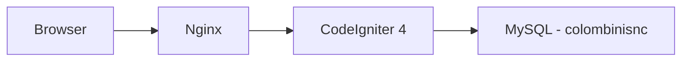
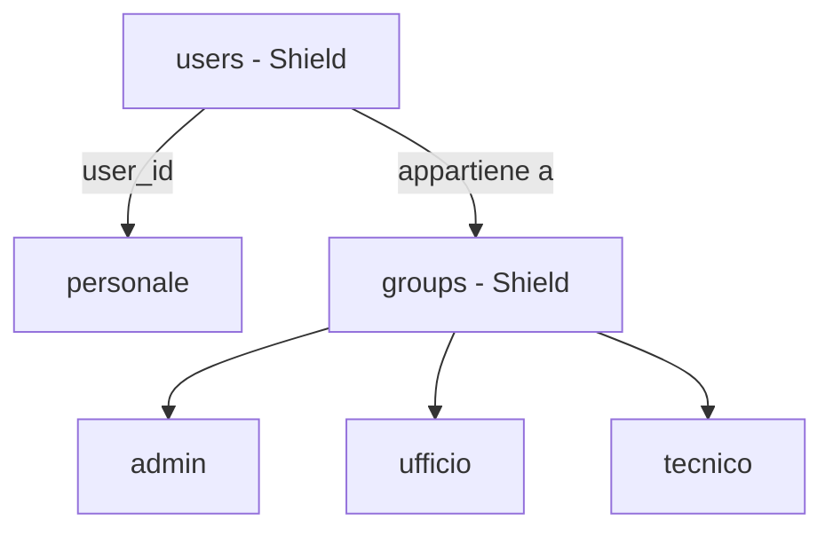
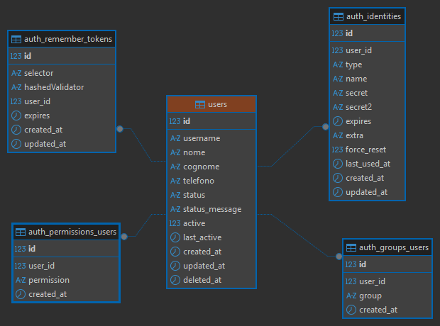

# Analisi del Software — [Colombini Snc]

## 1. Introduzione e contesto
### 1.1 Scopo del sistema
Gestionale interno per Colombini Snc, azienda specializzata nel 
trattamento acqua e costruzione piscine. Il sistema supporta la 
pianificazione e il tracciamento degli interventi tecnici presso 
i clienti, la gestione dei dipendenti e la visualizzazione del 
calendario lavori.
### 1.2 Obiettivi di business
- Sostituire la gestione manuale (carta/Google Calendar) degli interventi
- Ridurre le sovrapposizioni di appuntamenti
- Garantire puntualità nelle visite
- Gestione interventi programmati da abbonamenti
- Tenere traccia di materiali portati alle visite
- Dare ai tecnici visibilità sui propri interventi da smartphone
- Avere uno storico degli interventi per cliente
### 1.3 Stakeholder
| Ruolo | Descrizione | Accesso |
|-------|-------------|---------|
| Admin | Sviluppatore e titolari | Completo |
| Ufficio | Staff interno | Gestione interventi e calendario |
| Tecnico | Operatori sul campo | Visualizzazione e aggiornamento propri interventi |
| Cliente | Clienti aziendali | Accesso solo agli interventi a loro assegnati o richiesti da futuro portale|

### 1.4 Glossario
- **Intervento**: visita tecnica eseguita presso un cliente
- **Tecnico**: dipendente che esegue l'intervento sul campo
- **Stato intervento**: fase corrente (es. pianificato, in corso, completato)
- **Dispatcher**: figura dell'ufficio che pianifica e assegna gli interventi

## 2. Requisiti funzionali

### 2.1 Funzionalità

#### MVP
- Gestione utenti e permessi per ruolo
- Anagrafica clienti
- Anagrafica tecnici
- Creazione e assegnazione interventi
- Calendario interventi
- Aggiornamento stato intervento

#### Versioni successive
- Creazioni manutenzioni in abbonamento
- Dashboard dedicata ai tecnici con aggiornamento stato intervento
- Gestione magazzino
- Anagrafiche impianti
- Gestione creazione preventivi
- Sistema VRP con API OpenRouteService (OSR)
- Report e stampe
- Statistiche

### 2.2 Flussi operativi
### 2.3 Regole di business

## 3. Requisiti non funzionali

### 3.1 Performance
- Tempo di risposta pagine < 2 secondi
- Supporto a ~10 utenti simultanei

### 3.2 Sicurezza
- Autenticazione tramite sessione CI4
- Autorizzazioni per ruolo (admin, ufficio, tecnico, cliente)
- Protezione CSRF integrata in CI4
- Accesso tecnici limitato ai propri interventi

### 3.3 Disponibilità
- Sistema operativo sempre hostato su VPS esterna con dominio collegato
- Backup giornaliero del database MySQL su altra VPS esterna 
- Deploy su Nginx self-managed

### 3.4 Scalabilità
- Architettura sufficiente per ~10 tecnici e crescita clienti nel medio termine
- Nessun requisito di scalabilità orizzontale previsto, un singolo server Nginx è sufficiente per le dimensioni previste

## 4. Architettura del sistema

### 4.1 Stack tecnologico
- **PHP**: 8.2+
- **CodeIgniter**: 4.7.3
- **MySQL**: 8.x
- **AdminLTE**: 4.0.2 con Bootstrap 5.3.8
- **Frontend**: nessun bundler (Vite/webpack) — dipendenze gestite via npm + comando `assets:publish`

### 4.2 Diagramma dei componenti



### 4.3 Integrazioni esterne
- **OpenRouteService API**: calcolo percorsi ottimali per gli 
  spostamenti dei tecnici *(priorità bassa — versioni future)*

## 5. Interfaccia utente

### 5.1 Struttura e navigazione

**Cruscotto**
- Dashboard: riepilogo interventi da pianificare,
  presenze/assenze tecnici con link diretto al calendario sotto l'elenco intervento
- Calendario (pianificazione interventi con FullCalendar)

**Anagrafiche**
- Clienti: scheda con dati base, mappa OpenStreetMap su Leaflet,
  link Google Maps, storico interventi, note, materiali
- Tecnici

**Assistenza**
- Interventi: elenco + creazione
- Viaggi: interventi del giorno raggruppati per tecnico (solo staff)
  → click intervento → scheda cliente

**Amministrazione** *(solo admin)*
- Utenti e permessi

### 5.2 Requisiti mobile
- Interfaccia utilizzabile da smartphone dai tecnici sul campo
- Vista calendario semplificata su schermi piccoli
- Bottoni e touch target adeguati al tocco
- Viaggio del giorno filtrato per tecnico loggato con link diretto al cliente per poter aggiungere note e materiali futuri
- Aggiornamento stato intervento accessibile con pochi tap
- Chiusura intervento con generazione di pdf di rapportino, domanda se consegnati i materiali richiesti e indicati nell'intervento


## 6. Gestione dei dati

### 6.1 Entità principali
### 6.1 Entità principali

| Entità | Descrizione |
|--------|-------------|
| `users` | Gestita da CI4 Shield — autenticazione |
| `personale` | Dati anagrafici di tutto il personale (tecnici e staff),
                collegato a `users` tramite FK nullable |
| `clienti` | Anagrafica clienti con coordinate per mappa |
| `interventi` | Intervento tecnico presso un cliente |
| `tipi_intervento` | Tipologie di intervento |
| `stati_intervento` | Stati possibili dell'intervento |
| `viaggi` | Raggruppamento interventi per tecnico e giorno |
| `note` | Note operative collegate a cliente o intervento |
| `materiali` | Materiali utilizzati o da portare |

### 6.2 Autenticazione e autorizzazioni

**CI4 Shield** gestisce autenticazione e permessi:
- `users` — credenziali di accesso
- `groups` — ruoli (`admin`, `developer`, `ufficio`, `tecnico`, `cliente`)
- `users_groups` — relazione utente/gruppo

**`personale`** gestisce i dati operativi:
- Anagrafica (nome, cognome, telefono, colore calendario)
- Collegato a `users` tramite `user_id` FK nullable
- Utilizzato dall'applicazione indipendentemente da Shield



### 6.3 ER Diagram

### 6.4 Flussi di input/output
> Da compilare

### 6.5 Politiche di retention
> Da compilare

## 7. Piano di progetto

### 7.1 Milestone e fasi

#### ✅ v0.1.0 — Inizializzazione progetto
- Setup CI4 + AdminLTE 4 + Bootstrap 5.3.8
- Pipeline asset npm + assets:publish
- Layout admin con sidebar, navbar, dark mode
- Localizzazione italiana

#### ✅ v0.2.0 — Autenticazione
- Login/logout con CI4 Shield
- Gruppi utente: admin, staff, tecnici, clienti
- Protezione rotte con filtri Shield

#### ✅ v0.3.0 — Impostazioni base
- Navbar con dati utente loggato
- Pagina impostazioni con card

#### ✅ v0.4.0 — Anagrafica personale
- Migrazione: rimozione campi custom (nome, cognome, telefono) da users
- Creazione tabella `personale` con FK a `users`
- CRUD personale

#### ✅ v0.5.0 — Parametri generali
- Tabella `impostazioni` (class / key / value)
- Sede aziendale: nome, indirizzo, CAP, città, telefono, sito, logo, lat/lng + geocodifica
- Orari aziendali: inizio/fine giornata, pausa pranzo
- Durate standard interventi per tipo (sale, filtri, piscine, addolcitori, acquedotti, commerciale)

#### ✅ v0.6.0 — Profilo e visualizzazione changelog
- Visualizzazione changelog filtrata per `[DEV]` e `[APP]` a seconda del gruppo utente loggato
- Migrazione campo `ultima_versione_vista` su `users`; modal novità all'avvio con aggiornamento via AJAX
- Voce "Profilo" nel dropdown utente collegata alla scheda dipendente
- Pannello utente nella sidebar con nome, ruolo e link al profilo
- Restyling palette colori: navbar blu medio, sidebar-brand scura, separatore teal, versione nel footer
- Avatar rinviato a versione futura

#### ✅ v0.7.0 — Anagrafica clienti
- CRUD clienti completo (società e persone fisiche)
- Geocodifica automatica via Nominatim; `distanza_sede` calcolata con haversine ad ogni salvataggio
- Auto-assegnazione zona (Ventimiglia/Ceriale/Savona) da soglie longitudine configurabili in Parametri; zona manuale ha la precedenza
- ⚠️ **Zone da rivedere in versione futura**: il sistema attuale a 3 zone fisse è una macro-semplificazione — nella pratica le zone si suddividono ulteriormente (es. Varazze-Loano dentro Savona). Architettura target: tabella `zone` con `nome`, `lng_min`, `lng_max`, `ordine`; ogni cliente si auto-assegna alla zona il cui range contiene la sua longitudine. Stessa logica geolocalizzazione, numero zone libero, nomi configurabili dall'utente. Il pool del calendario raggrupperà per zona quando questo sarà implementato.
- Scheda cliente a tab: Anagrafica (attiva) · Interventi · Materiali (placeholder v0.8.0)
- Lista clienti con DataTables: ricerca testuale, ordinamento multi-colonna, paginazione
- `codice_esterno` per collegamento con software di contabilità esterno
- Denominazione e città forzate in maiuscolo nel model
- jQuery + DataTables via npm; sezione `styles` nel layout per CSS page-specific; tooltip Bootstrap inizializzati globalmente
- Guida di pagina per la sezione clienti rinviata a milestone futura

#### ✅ v0.8.0 — Interventi
- CRUD interventi: cliente, tecnico assegnato, genere, tipo intervento (entità separata con icona e durata default), stato, data pianificata, data scadenza, durata stimata, urgenza, note
- Generi intervento: `programmato`, `normale`, `sopralluogo`, `commerciale` (costanti nel model)
- Stati intervento: `da_pianificare` (default), `pianificato`, `in_corso`, `completato`, `annullato` (costanti nel model)
- `urgenza`: flag booleano (0/1) indipendente dal genere — qualsiasi intervento può essere marcato urgente
- `data_scadenza`: entro quando deve essere eseguito (distinta da `data_pianificata`); data pianificata senza orario — l'orario verrà impostato dal calendario (v0.12.0)
- `durata_stimata` in minuti, nullable — preleva il default dal tipo intervento selezionato
- Creazione da scheda cliente (link diretto, pre-compilato); sistema `from` per ritorno al tab Interventi dopo modifica/creazione/eliminazione
- Scheda cliente: pagina `show` read-only separata da `edit`; tab Interventi con DataTables e filtri rapidi; badge numero interventi nella lista
- `impianto_id` nullable (placeholder per v0.14.0; FK aggiunta subito per evitare ALTER futuri)
- Tabella `interventi_materiali` creata; gestione materiali nell'edit intervento; tab Materiali nella scheda cliente rinviato a v0.10.0

#### ✅ v0.9.0 — Magazzino base
- Tabella `categorie_articoli`: codice, nome, ordine — CRUD mini come tipi_intervento
- Tabella `articoli`: codice, descrizione, categoria_id, costo (prezzo acquisto), vendita (listino aziendale), giacenza (nullable — gestione avanzata in v0.16.0), attivo
- Categorie iniziali: Prodotti (cloro, sale, antialghe, acido…), Attrezzature (retini, test kit…), Apparecchiature (addolcitori…), Ricambi (futuro import da DB esterno)
- `articolo_id` nullable aggiunto a `interventi_materiali`: selezione da catalogo nel form materiali; descrizione libera ancora possibile per articoli ad hoc
- Selezione articolo nel form materiali: autocomplete/select per categoria + articolo, prezzo vendita auto-compilato

#### ✅ v0.10.0 — Materiali interventi e scheda cliente
- `genere` rinominato `priorità` con valori `programmato`, `normale`, `urgente` (rimossi `sopralluogo` e `commerciale`); migrazione con rimappatura valori esistenti
- Campo `stato` aggiunto a `interventi_materiali` (`da_portare` / `consegnato`); default `da_portare` all'inserimento
- Tom Select per selezione materiali: autocomplete da catalogo + testo libero in unico campo; `createOnBlur: true` per conferma senza premere Invio
- Scheda read-only intervento (`show`): dati + materiali con note e stato; link dal codice in index e scheda cliente
- Form edit intervento: tab materiali eliminata, sezione materiali inline scrollabile sotto il form
- Form nuovo intervento: sezione materiali con lista JS client-side (aggiungi/rimuovi prima del salvataggio); tutto inviato in una POST
- Tab Materiali nella scheda cliente: rowGroup per intervento, badge stato, link alla show intervento
- Sistema `from` esteso attraverso `MaterialiController`: `from` preservato nei redirect aggiunta/eliminazione materiale
- Contatore "Da portare" per intervento nella scheda cliente
- Appunti tecnici (da implementare in milestone futura): doppio click sulle righe DataTables, bottone × nell'header delle card, tabelle responsive

#### ✅ v0.11.0 — Materiali sospesi
- Un materiale può essere legato al **cliente** senza ancora un intervento, come promemoria "da portare al prossimo giro"
- `interventi_materiali`: `intervento_id` diventa nullable; si aggiunge `cliente_id` (sempre valorizzato)
- Eliminazione intervento: cascade delete sui materiali (hard delete — la cancellazione è sempre un errore, non un "rimanda"; il caso "rimanda" si gestisce tenendo l'intervento con stato `da_pianificare`)
- Scheda cliente — tab Materiali: sezione "Materiali da portare" con elenco sospesi + mini-form aggiunta rapida; i materiali con intervento restano nel rowGroup sottostante
- ✅ Implementato in v0.11.3: collegamento dei materiali sospesi a un nuovo intervento dal form di creazione

#### ✅ v0.11.1 — Redesign scheda cliente
- Layout verticale scrollabile a sezioni sticky (Anagrafica · Materiali da portare · Interventi) — rimosso il sistema a tab Bootstrap
- Header compatto con denominazione, badge stato, azioni e back link
- Nav anchor laterale (≥1400px) con highlight sezione attiva via IntersectionObserver
- Nuova pagina storico materiali `/clienti/{id}/materiali`: sospesi + materiali per intervento raggruppati con group header e spacer row; Qtà in prima colonna per indentazione visiva

#### ✅ v0.11.2 — Chiudi intervento + fix dark mode
- Pulsante "Chiudi intervento" nella scheda read-only: modal con domanda sui materiali (Sì/No)
- Materiali non consegnati → tornano sospesi con nota `[Da INT-XXX]`
- Rimosso `table-light` da tutti i `<thead>` (dark mode)
- ID DB visibile on hover su righe e cross-reference nelle view

#### ✅ v0.11.3 — Sospesi nel nuovo intervento
- Nel form "Nuovo intervento", dopo la selezione del cliente, se esistono materiali sospesi appare una sezione con la lista e checkbox per selezionare quali portare
- I sospesi selezionati vengono **spostati** (non copiati): al salvataggio viene impostato `intervento_id` sulla riga esistente — nessuna riga nuova creata
- I sospesi non selezionati rimangono sospesi e continuano ad apparire nella scheda cliente
- **Edge case — eliminazione intervento**: prima del hard delete, i materiali dell'intervento vengono liberati (`intervento_id = NULL`) così sopravvivono al CASCADE e tornano sospesi automaticamente
- La sezione sospesi è visibile solo se il cliente ha almeno un sospeso; non appare se cliente non ancora selezionato

#### ✅ v0.12.0 — Calendario
- FullCalendar 6 via npm (bundle global + locale IT); `public/css/calendario.css` dedicato con dark mode override via `--fc-*`
- Griglia con viste giorno/settimana/mese; slot 07:00–20:00; eventi colorati per tecnico (`personale.colore`)
- Pool "Da pianificare": sidebar affiancata, interventi raggruppati per zona geografica con barra colorata collassabile
- Drag & drop dal pool → modal pianifica (tecnico + ora) → AJAX POST → stato `da_pianificare` → `pianificato`
- Click evento → modal dettaglio; drag interno → sposta data/ora; bottone × → annulla pianificazione e riporta nel pool
- Filtro pill per tecnico; `data_pianificata` a `datetime-local` in form edit; descrizione intervento resa obbligatoria
- Elenco interventi: filtri "Da pianificare" / Pianificati / Completati / Annullati ("In corso" accorpato a Pianificati fino a v0.13.0)
- *Nota: il pool mostra tutti gli interventi `da_pianificare` senza filtro per periodo — variante più semplice e operativamente più utile della specifica originale*
- *Nota: milestone anticipata rispetto ad Abbonamenti perché ne è prerequisito operativo*

#### ✅ v0.13.0 — Viaggi
- Vista giornaliera di tutti gli interventi pianificati, ordinati per ora e raggruppati per zona geografica (stessa palette colori dell'index clienti e del pool calendario)
- Navigazione per data con frecce e selettore; bottone "Oggi"
- Materiali "da portare" come lista puntata nella cella tipo/descrizione; quantità sempre mostrata
- PDF foglio di viaggio (dompdf 3.1.5): A4 landscape, intestazioni zona colorate, colonna Firma
- `InterventiMaterialiModel::normalizza()`: copia automatica di `articoli.descrizione` al `$beforeInsert`; seeder backfill per i record esistenti
- *Nota: la vista è di sola lettura (nessun salvataggio a DB) — gli interventi sono già in DB; la stampa fisica è lo snapshot per il campo*
- *Nota: la vista per tecnico mobile è rinviata a versione successiva*

#### ✅ v0.14.0 — Abbonamenti
- **Flusso invertito rispetto alla concezione iniziale**: l'abbonamento nasce a livello di cliente (non più come effetto collaterale silenzioso del salvataggio di un intervento) e da esso vengono generati gli interventi collegati
- Genere/priorità intervento `programmato` rinominato `abbonamento`; non modificabile dalla scheda intervento quando l'intervento è già collegato a un abbonamento (il campo è "di proprietà" dell'abbonamento, non dell'intervento)
- Nuova FK **`abbonamento_id` nullable diretta su `interventi`** (one-to-many: un abbonamento → molti interventi). Sostituisce la precedente ipotesi di tabella pivot `abbonamenti_interventi`, non più necessaria: un intervento appartiene a un solo abbonamento
- Form/UI di creazione abbonamento (a livello cliente): raccoglie data inizio/fine validità, prezzo totale e uno o più **periodi di frequenza**
- **`abbonamenti_periodi`**: un abbonamento ha N periodi, ciascuno con `data_inizio`, `data_fine`, `frequenza`, `con_pulizia_fondo`. Sostituisce il campo `frequenza` singolo sull'abbonamento. La generazione batch itera sui periodi in sequenza
- Frequenze per periodo: settimanale, quindicinale, mensile, bimestrale, trimestrale, semestrale, annuale
- `con_pulizia_fondo TINYINT` su `abbonamenti_periodi`: opzione specifica piscine, visibile nel form solo quando il tipo abbonamento è piscine. Campo booleano, default 0
- Stati abbonamento: `attivo`, `sospeso`, `scaduto`, `disdetto` (costanti nel model)
- `durata_mesi` calcolata automaticamente nel model
- `abbonamento_precedente_id` per catena storica (navigabile con CTE ricorsiva MySQL 8+)
- `prezzo` = totale abbonamento, non per visita
- **Generazione interventi**: tutti gli interventi previsti dalla durata dell'abbonamento vengono creati in un'unica passata al momento della creazione dell'abbonamento (batch, non uno alla volta a chiusura del precedente)
- Per **ogni** intervento generato: `data_pianificata = NULL` e `data_scadenza` = fine del sotto-periodo di competenza; stato iniziale `da_pianificare`. Il giorno/orario preciso viene assegnato in seguito dal dispatcher tramite il pool "Da pianificare" del Calendario
- Scheda cliente: la sezione Abbonamenti mostra **una riga per abbonamento** (contratto). Il dettaglio dei periodi è nella scheda abbonamento dedicata
- `tipi_intervento.abbonabile TINYINT`: flag che indica se un tipo può essere usato negli abbonamenti; la select di creazione abbonamento mostra solo i tipi con `abbonabile = 1`
- Spec dettagliata in `docs/abbonamenti_spec.md`
- *Fix v0.14.0: `InterventiModel::normalizza()` usava `!isset()` che è `true` anche con `id = null` in bulk UPDATE → duplicati su UNIQUE constraint; corretto con `!array_key_exists()`*
- *Fix v0.14.0: disdetta abbonamento avvolta in transazione; interventi figli in `da_pianificare` marcati `annullato` in batch*
- *Fix v0.14.0: subquery `num_interventi` in `ClientiModel` filtrata su `abbonamento_id IS NULL AND stato NOT IN ('completato','annullato')`*

#### ✅ v0.14.1 — Fix frecce DataTables
- *Fix: DataTables 2.x imposta `flex-direction:row-reverse` su `div.dt-column-header` per le colonne `dt-type-numeric`, mettendo le frecce a sinistra del testo. Override a `flex-direction:row` via CSS per i `<th class="text-center">` (Interventi e Zona in lista clienti)*

#### ✅ v0.15.0 — Abbonamenti: prossima visita, visite extra, pulizia fondo
- **Next-by-scadenza**: alla chiusura di un intervento con materiali "non portati", il sistema cerca il prossimo intervento aperto dello stesso abbonamento (per `data_scadenza`) e riassegna i materiali direttamente su di esso invece di lasciarli sospesi sul cliente. Se non esiste un prossimo univoco, il comportamento precedente (materiali sospesi sul cliente) viene preservato
- **Visite extra**: dalla scheda abbonamento si può creare un intervento aggiuntivo fuori piano (`extra = 1`, `priorita = 'abbonamento'`); tipo intervento pre-compilato in readonly; sincronizzazione bidirezionale `data_pianificata` ↔ `data_scadenza` via JS
- **Flag pulizia fondo**: ogni intervento generato eredita `pulizia_fondo` dal campo `con_pulizia_fondo` del periodo; l'operatore può modificarlo al momento della chiusura (checkbox visibile solo per tipi con `ha_pulizia_fondo = 1`)
- Migration `AddExtraAndPuliziaFondoToInterventi`: aggiunge `extra TINYINT(1) DEFAULT 0` e `pulizia_fondo TINYINT(1) DEFAULT 0` su `interventi`

#### ✅ v0.16.0 — Diario interventi
- **Diario di note datate** per ogni intervento: ogni voce ha `data_nota`, `testo` e autore. La cronologia evita di sovrascrivere il campo `note` unico quando si registrano aggiornamenti progressivi (caso d'uso: aperture piscine e lavori multi-visita, es. "15.06 vuotata → 20.06 in riempimento → 24.06 avviato")
- Scrittura nella modifica intervento, accanto ai materiali (note e materiali si trascrivono insieme); sola lettura nella scheda read-only
- Tabella `interventi_note` (FK `intervento_id` CASCADE) + `InterventiNoteModel`; metodi `aggiungiNota()`/`eliminaNota()` nel controller con sistema `from`
- *Nota: il campo `note` legacy dell'intervento resta per ora accanto al diario — da valutare se renderlo ridondante in futuro*
- *Mini-edit di una nota esistente: rinviato a versione futura*

#### ✅ v0.16.1 — Sezioni interventi per area
- **Lista interventi divisa per area** dal menu treeview: Generici / Piscine / Addolcitori. View unica parametrica via `?sezione`, senza nuove rotte né view duplicate; ogni sezione mostra solo la propria categoria (i Generici includono gli interventi senza tipo)
- Campo `categoria` su `tipi_intervento` (default `generale`/`Generici`); flag `apertura` / `chiusura` su `interventi` con guardia di mutua esclusione; **fase** ordinaria/apertura/chiusura nel form, visibile solo per i tipi Piscine
- Pill **Aperture**/**Chiusure** (Piscine) e **Abbonamenti** (Piscine/Addolcitori); badge **Apertura**/**Chiusura** in lista, scheda intervento e scheda cliente
- Scheda cliente: badge **Extra** in tabella interventi; sezione **Interventi** spostata sopra **Abbonamenti**; fix ordinamento al click sugli input di ricerca
- *Idee future correlate: dashboard riepilogativa dei flag; "Da pianificare per periodo" sugli abbonamenti*

#### ✅ v0.17.0 — Cantieri

Un **cantiere** raggruppa più interventi legati a un unico progetto per un cliente (nuova costruzione o ristrutturazione). Si distingue dagli interventi "standalone" (manutenzioni, abbonamenti) che non appartengono a nessun progetto.

**Modello dati implementato**
- Tabella `cantieri`: `cliente_id` FK RESTRICT, `titolo`, `tipo` VARCHAR (nuova_costruzione / ristrutturazione), `tipo_intervento_id` nullable FK SET NULL (default pre-compilazione form), `stato` VARCHAR (aperto / sospeso / chiuso), `data_inizio`, `data_fine_prevista`, `note`, campi standard
- Tabella `cantieri_note`: diario cronologico datato — `cantiere_id` FK CASCADE, `data_nota`, `testo`, campi standard. Stessa struttura di `interventi_note`
- Colonna `cantiere_id INT UNSIGNED NULL FK → cantieri.id RESTRICT` su `interventi` (gemella di `abbonamento_id`)
- Decisione chiave: note e interventi sono fratelli figli del cantiere, non collegati tra loro. Le note sono prosa libera; quando una nota diventa lavoro concreto si crea un intervento e lo si aggancia al cantiere

**Flusso operativo**
1. Si apre un cantiere sul cliente con titolo, tipo e tipo intervento predefinito (opzionale)
2. Si aggiungono note al diario man mano che avanza il lavoro (prosa libera datata)
3. Quando un appunto diventa lavoro concreto, si crea un intervento dalla scheda cantiere — il tipo viene pre-compilato dal default del cantiere ma resta modificabile
4. L'intervento entra nel pool "Da pianificare" del Calendario e segue il flusso normale
5. Il cambio di stato del cantiere (aperto / sospeso / chiuso) non produce effetti a cascata sugli interventi

**Navigazione implementata**
- Lista cantieri globale (`/cantieri`) — voce menu laterale tra Abbonamenti e Calendario
- Scheda cantiere: header con azioni cambio-stato + bottone elimina (bloccato se ci sono interventi collegati); sezione interventi collegati; diario con mini-form aggiungi nota
- Scheda cliente: sezione **Cantieri** con indice sottile — contatore "⚠ N da pianificare", anteprima ultima nota, link Apri. Gli interventi di cantiere sono **esclusi** dalla lista interventi piatta della scheda cliente (opzione A — si vedono solo sotto il loro cantiere)
- Scheda intervento e form modifica: banner con link al cantiere se collegato
- Calendario — modal pianifica: avviso inline (non bloccante) se la data pianificata supera la `data_scadenza` dell'intervento; avviso rosso per urgenti, giallo per normali

#### 🔲 v0.18.0 — Dashboard e report
- Dashboard riepilogativa: interventi oggi, settimana, tecnici in campo, abbonamenti in scadenza
- Presenze/assenze tecnici
- Report PDF: interventi per cliente, materiali consegnati, abbonamenti attivi
- Statistiche: interventi per tipo/periodo, km percorsi, prodotti consumati

#### 🔲 v1.0.0 — Release
- Test e fix generali
- Ottimizzazione percorsi con OpenRouteService (VRP giornaliero per tecnico)
- Deploy su Nginx (dominio colombini-snc.it)

### 7.1.1 Funzionalità post v1.0.0

Da pianificare dopo la release iniziale in base alle priorità operative emerse dall'uso reale.

#### Anagrafica impianti
- Tabella `impianti`: tipo (piscina, addolcitore, acquedotto, trattamento acqua, altro), marca, modello, note
- Tabella `clienti_impianti`: FK cliente + FK impianto + indirizzo specifico dell'impianto se diverso dal cliente
- Collegamento impianto agli interventi (popola `impianto_id` lasciato nullable dalla v0.8.0)
- Scheda cliente: nuovo tab **Impianti**

#### Richieste di intervento
- Tabella `richieste`: cliente, tipo, descrizione, priorità, stato, tecnico suggerito
- Flusso: richiesta → approvazione → conversione in intervento pianificato
- Badge notifica in sidebar per richieste in attesa

#### Magazzino avanzato
- Gestione giacenza: movimenti di carico/scarico con tabella `movimenti_magazzino`
- Scarico automatico giacenza quando si inseriscono materiali su un intervento
- Soglia minima per articolo; alert sottoscorta in dashboard
- Import ricambi da DB esterno (integrazione con sistema esistente)

#### Preventivi
- Tabella `preventivi`: cliente, data, stato (bozza/inviato/accettato/rifiutato), totale
- Righe preventivo: articolo da catalogo o descrizione libera, quantità, prezzo unitario
- Conversione preventivo accettato → intervento/abbonamento

### 7.2 Mappa dipendenze tra moduli

```
personale ──────────────────────────────────────────────┐
                                                        ↓
clienti ──→ clienti_impianti ──→ impianti               interventi
    │                                │                      │
    │                                └──────────────────────┤
    │                                                        │
    └──→ richieste ────────────────────────────────────────→ ┤
                                                            │
preventivi ──────────────────────────────────────────────→ ┤
                                                            │
                                                            ├──→ abbonamenti
                                                            │       └──→ interventi (FK abbonamento_id)
                                                            │
                                                            └──→ interventi_materiali
                                                                        │
                                                                        ↓
                                                                    prodotti (magazzino)
```

### 7.3 Funzionalità versioni future (post-release)
- Portale clienti: accesso autonomo a storico interventi e abbonamenti (`user_id` già in `clienti`)
- Portale tecnici mobile dedicato (PWA o app nativa) — prima di svilupparlo, rivedere tutto il gestionale in ottica mobile-first: layout, tabelle, form. Il gestionale attuale è progettato per desktop (schermi fino a 27"); il check mobile è rimandato intenzionalmente a questa fase.
- Notifiche push/email per promemoria interventi e abbonamenti in scadenza
- Firma digitale cliente a chiusura intervento (libreria: Signature Pad; salvata come base64 in colonna DB — es. `firma_cliente` MEDIUMTEXT su `interventi` — non come file su disco)

### 7.4 Rischi e mitigazioni

| Rischio | Probabilità | Mitigazione |
|---------|-------------|-------------|
| Scope creep prima della v1.0 | Alta | Rispettare le milestone, rimandare tutto il resto alle versioni future |
| Complessità FullCalendar + API REST | Media | Prototipare prima con dati statici |
| Usabilità mobile per i tecnici | Media | Test sul campo rimandato a data da definirsi — presumibilmente dopo l'entrata in funzione del sistema in ufficio, in vista del Portale tecnici mobile dedicato (vedi 7.3) |

## 8. Decisioni tecniche

### Nessun bundler (Vite/Webpack)
Scelto di gestire le dipendenze frontend tramite npm + comando 
`assets:publish` di CI4. Evita la complessità di configurazione 
di un bundler per un progetto di questa scala.

### CI4 Shield per l'autenticazione
Scelto Shield invece di un sistema custom per non reinventare 
la ruota su autenticazione, gestione sessioni e permessi. 
Fornisce gruppi e filtri già integrati con CI4.

### Tabella `personale` separata da `users`
`users` è gestita da Shield e non va modificata. `personale` 
contiene i dati anagrafici operativi di tutto il personale 
(tecnici e staff), collegata a `users` tramite FK nullable. 
Permette profili personalizzati senza toccare Shield.

### Leaflet + OpenStreetMap per le mappe
Scelto Leaflet per la visualizzazione mappe nella scheda cliente. 
Nessuna API key necessaria. Link a Google Maps tramite coordinate 
per navigazione sul campo dai tecnici.

### OpenRouteService rimandato
Integrazione per percorsi ottimali rimandata a versioni future — 
funzionalità utile ma non bloccante per il MVP.

### Abbonamenti: flusso invertito (cliente → abbonamento → interventi)
Concezione iniziale (creazione silenziosa di un abbonamento al salvataggio 
di un intervento `programmato`) abbandonata: semanticamente invertita, 
un abbonamento è il contratto e l'intervento è la sua esecuzione, non 
il contrario. Il nuovo flusso parte dalla gestione abbonamenti a livello 
cliente, che genera in batch tutti gli interventi previsti dalla durata 
del contratto. FK diretta `abbonamento_id` su `interventi` al posto della 
pivot `abbonamenti_interventi` (relazione one-to-many, non many-to-many). 
Questo richiede che il Calendario (v0.12.0) preceda Abbonamenti (v0.14.0), 
poiché la generazione batch si appoggia sul concetto di "pool non 
pianificati" introdotto dal Calendario stesso.

### Abbonamenti: periodi multipli per frequenza variabile
La frequenza di visita può variare all'interno dello stesso contratto annuale
(es. piscine: quindicinale in primavera/autunno, settimanale in estate).
Alternativa scartata: abbonamenti separati collegati da `gruppo_id` — spezzava
il contratto in N record, rendendo rumorosa la scheda cliente e scomodo il
rinnovo annuale. Soluzione adottata: tabella `abbonamenti_periodi` (N periodi
per abbonamento, ognuno con `data_inizio`, `data_fine`, `frequenza`). La
generazione batch itera sui periodi. La scheda cliente mostra sempre una riga
per abbonamento; il dettaglio dei periodi è nella scheda abbonamento.

### Abbonamenti: opzioni per-periodo (`con_pulizia_fondo`)
Alcune tipologie di abbonamento (piscine) prevedono opzioni operative che
variano per periodo (es. pulizia del fondo solo in estate). Soluzione adottata:
campo booleano `con_pulizia_fondo TINYINT` su `abbonamenti_periodi`, visibile
nel form solo quando il tipo abbonamento è piscine.
**Opzione alternativa per future esigenze**: se proliferano le opzioni
per-periodo (es. `con_dosaggio_chimico`, `con_analisi_acqua`) valutare un
campo `opzioni JSON` su `abbonamenti_periodi` + `opzioni_config JSON` su
`tipi_intervento` per rendere le opzioni configurabili senza migrazioni.
Giustificato solo con ≥3 tipi di opzioni eterogenee.
