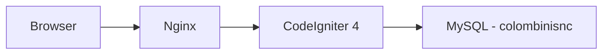
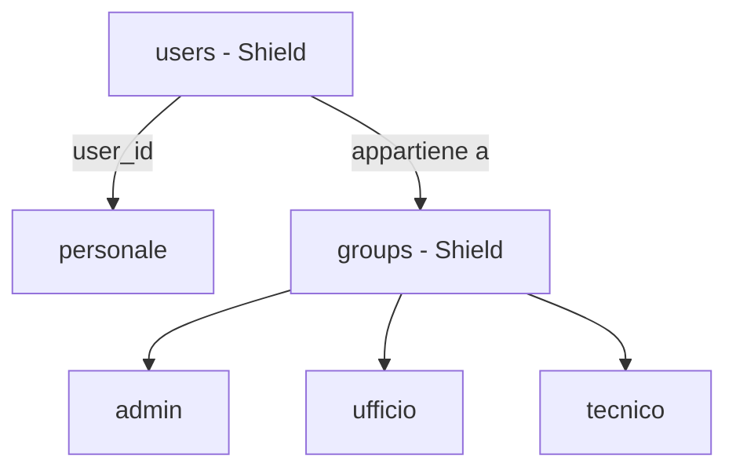

# Analisi del Software — [Colombini Snc]

## 1. Introduzione e contesto
### 1.1 Scopo del sistema
Gestionale interno per Colombini Snc, azienda specializzata nel 
trattamento acqua e costruzione piscine. Il sistema supporta la 
pianificazione e il tracciamento degli interventi tecnici presso 
i clienti, la gestione dei dipendenti e la visualizzazione del 
calendario lavori.
### 1.2 Obiettivi di business
- Sostituire la gestione manuale (carta/Google Calendar) degli interventi
- Ridurre le sovrapposizioni di appuntamenti
- Garantire puntualità nelle visite
- Gestione interventi programmati da abbonamenti
- Tenere traccia di materiali portati alle visite
- Dare ai tecnici visibilità sui propri interventi da smartphone
- Avere uno storico degli interventi per cliente
### 1.3 Stakeholder
| Ruolo | Descrizione | Accesso |
|-------|-------------|---------|
| Admin | Sviluppatore e titolari | Completo |
| Ufficio | Staff interno | Gestione interventi e calendario |
| Tecnico | Operatori sul campo | Visualizzazione e aggiornamento propri interventi |
| Cliente | Clienti aziendali | Accesso solo agli interventi a loro assegnati o richiesti da futuro portale|

### 1.4 Glossario
- **Intervento**: visita tecnica eseguita presso un cliente
- **Tecnico**: dipendente che esegue l'intervento sul campo
- **Stato intervento**: fase corrente (es. pianificato, in corso, completato)
- **Dispatcher**: figura dell'ufficio che pianifica e assegna gli interventi

## 2. Requisiti funzionali

### 2.1 Funzionalità

#### MVP
- Gestione utenti e permessi per ruolo
- Anagrafica clienti
- Anagrafica tecnici
- Creazione e assegnazione interventi
- Calendario interventi
- Aggiornamento stato intervento

#### Versioni successive
- Creazioni manutenzioni in abbonamento
- Dashboard dedicata ai tecnici con aggiornamento stato intervento
- Gestione magazzino
- Anagrafiche impianti
- Gestione creazione preventivi
- Sistema VRP con API OpenRouteService (OSR)
- Report e stampe
- Statistiche

### 2.2 Flussi operativi
### 2.3 Regole di business

## 3. Requisiti non funzionali

### 3.1 Performance
- Tempo di risposta pagine < 2 secondi
- Supporto a ~10 utenti simultanei

### 3.2 Sicurezza
- Autenticazione tramite sessione CI4
- Autorizzazioni per ruolo (admin, ufficio, tecnico, cliente)
- Protezione CSRF integrata in CI4
- Accesso tecnici limitato ai propri interventi

### 3.3 Disponibilità
- Sistema operativo sempre hostato su VPS esterna con dominio collegato
- Backup giornaliero del database MySQL su altra VPS esterna 
- Deploy su Nginx self-managed

### 3.4 Scalabilità
- Architettura sufficiente per ~10 tecnici e crescita clienti nel medio termine
- Nessun requisito di scalabilità orizzontale previsto, un singolo server Nginx è sufficiente per le dimensioni previste

## 4. Architettura del sistema

### 4.1 Stack tecnologico
- **PHP**: 8.2+
- **CodeIgniter**: 4.7.3
- **MySQL**: 8.x
- **AdminLTE**: 4.0.2 con Bootstrap 5.3.8
- **Frontend**: nessun bundler (Vite/webpack) — dipendenze gestite via npm + comando `assets:publish`

### 4.2 Diagramma dei componenti



### 4.3 Integrazioni esterne
- **OpenRouteService API**: calcolo percorsi ottimali per gli 
  spostamenti dei tecnici *(priorità bassa — versioni future)*

## 5. Interfaccia utente

### 5.1 Struttura e navigazione

**Cruscotto**
- Dashboard: riepilogo interventi da pianificare,
  presenze/assenze tecnici con link diretto al calendario sotto l'elenco intervento
- Calendario (pianificazione interventi con FullCalendar)

**Anagrafiche**
- Clienti: scheda con dati base, mappa OpenStreetMap su Leaflet,
  link Google Maps, storico interventi, note, materiali
- Tecnici

**Assistenza**
- Interventi: elenco + creazione
- Viaggi: interventi del giorno raggruppati per tecnico (solo staff)
  → click intervento → scheda cliente

**Amministrazione** *(solo admin)*
- Utenti e permessi

### 5.2 Requisiti mobile
- Interfaccia utilizzabile da smartphone dai tecnici sul campo
- Vista calendario semplificata su schermi piccoli
- Bottoni e touch target adeguati al tocco
- Viaggio del giorno filtrato per tecnico loggato con link diretto al cliente per poter aggiungere note e materiali futuri
- Aggiornamento stato intervento accessibile con pochi tap
- Chiusura intervento con generazione di pdf di rapportino, domanda se consegnati i materiali richiesti e indicati nell'intervento


## 6. Gestione dei dati

### 6.1 Entità principali
### 6.1 Entità principali

| Entità | Descrizione |
|--------|-------------|
| `users` | Gestita da CI4 Shield — autenticazione |
| `personale` | Dati anagrafici di tutto il personale (tecnici e staff),
                collegato a `users` tramite FK nullable |
| `clienti` | Anagrafica clienti con coordinate per mappa |
| `interventi` | Intervento tecnico presso un cliente |
| `tipi_intervento` | Tipologie di intervento |
| `stati_intervento` | Stati possibili dell'intervento |
| `viaggi` | Raggruppamento interventi per tecnico e giorno |
| `note` | Note operative collegate a cliente o intervento |
| `materiali` | Materiali utilizzati o da portare |

### 6.2 Autenticazione e autorizzazioni

**CI4 Shield** gestisce autenticazione e permessi:
- `users` — credenziali di accesso
- `groups` — ruoli (`admin`, `developer`, `ufficio`, `tecnico`, `cliente`)
- `users_groups` — relazione utente/gruppo

**`personale`** gestisce i dati operativi:
- Anagrafica (nome, cognome, telefono, colore calendario)
- Collegato a `users` tramite `user_id` FK nullable
- Utilizzato dall'applicazione indipendentemente da Shield



### 6.3 ER Diagram

### 6.4 Flussi di input/output
> Da compilare

### 6.5 Politiche di retention
> Da compilare

## 7. Piano di progetto

### 7.1 Milestone e fasi

#### ✅ v0.1.0 — Inizializzazione progetto
- Setup CI4 + AdminLTE 4 + Bootstrap 5.3.8
- Pipeline asset npm + assets:publish
- Layout admin con sidebar, navbar, dark mode
- Localizzazione italiana

#### ✅ v0.2.0 — Autenticazione
- Login/logout con CI4 Shield
- Gruppi utente: admin, staff, tecnici, clienti
- Protezione rotte con filtri Shield

#### ✅ v0.3.0 — Impostazioni base
- Navbar con dati utente loggato
- Pagina impostazioni con card

#### ✅ v0.4.0 — Anagrafica personale
- Migrazione: rimozione campi custom (nome, cognome, telefono) da users
- Creazione tabella `personale` con FK a `users`
- CRUD personale

#### ✅ v0.5.0 — Parametri generali
- Tabella `impostazioni` (class / key / value)
- Sede aziendale: nome, indirizzo, CAP, città, telefono, sito, logo, lat/lng + geocodifica
- Orari aziendali: inizio/fine giornata, pausa pranzo
- Durate standard interventi per tipo (sale, filtri, piscine, addolcitori, acquedotti, commerciale)

#### ✅ v0.6.0 — Profilo e visualizzazione changelog
- Visualizzazione changelog filtrata per `[DEV]` e `[APP]` a seconda del gruppo utente loggato
- Migrazione campo `ultima_versione_vista` su `users`; modal novità all'avvio con aggiornamento via AJAX
- Voce "Profilo" nel dropdown utente collegata alla scheda dipendente
- Pannello utente nella sidebar con nome, ruolo e link al profilo
- Restyling palette colori: navbar blu medio, sidebar-brand scura, separatore teal, versione nel footer
- Avatar rinviato a versione futura

#### ✅ v0.7.0 — Anagrafica clienti
- CRUD clienti completo (società e persone fisiche)
- Geocodifica automatica via Nominatim; `distanza_sede` calcolata con haversine ad ogni salvataggio
- Auto-assegnazione zona (Ventimiglia/Ceriale/Savona) da soglie longitudine configurabili in Parametri; zona manuale ha la precedenza
- Scheda cliente a tab: Anagrafica (attiva) · Interventi · Materiali (placeholder v0.8.0)
- Lista clienti con DataTables: ricerca testuale, ordinamento multi-colonna, paginazione
- `codice_esterno` per collegamento con software di contabilità esterno
- Denominazione e città forzate in maiuscolo nel model
- jQuery + DataTables via npm; sezione `styles` nel layout per CSS page-specific; tooltip Bootstrap inizializzati globalmente
- Guida di pagina per la sezione clienti rinviata a milestone futura

#### ✅ v0.8.0 — Interventi
- CRUD interventi: cliente, tecnico assegnato, genere, tipo intervento (entità separata con icona e durata default), stato, data pianificata, data scadenza, durata stimata, urgenza, note
- Generi intervento: `programmato`, `normale`, `sopralluogo`, `commerciale` (costanti nel model)
- Stati intervento: `da_pianificare` (default), `pianificato`, `in_corso`, `completato`, `annullato` (costanti nel model)
- `urgenza`: flag booleano (0/1) indipendente dal genere — qualsiasi intervento può essere marcato urgente
- `data_scadenza`: entro quando deve essere eseguito (distinta da `data_pianificata`); data pianificata senza orario — l'orario verrà impostato dal calendario (v0.12.0)
- `durata_stimata` in minuti, nullable — preleva il default dal tipo intervento selezionato
- Creazione da scheda cliente (link diretto, pre-compilato); sistema `from` per ritorno al tab Interventi dopo modifica/creazione/eliminazione
- Scheda cliente: pagina `show` read-only separata da `edit`; tab Interventi con DataTables e filtri rapidi; badge numero interventi nella lista
- `impianto_id` nullable (placeholder per v0.14.0; FK aggiunta subito per evitare ALTER futuri)
- Tabella `interventi_materiali` creata; gestione materiali nell'edit intervento; tab Materiali nella scheda cliente rinviato a v0.10.0

#### ✅ v0.9.0 — Magazzino base
- Tabella `categorie_articoli`: codice, nome, ordine — CRUD mini come tipi_intervento
- Tabella `articoli`: codice, descrizione, categoria_id, costo (prezzo acquisto), vendita (listino aziendale), giacenza (nullable — gestione avanzata in v0.16.0), attivo
- Categorie iniziali: Prodotti (cloro, sale, antialghe, acido…), Attrezzature (retini, test kit…), Apparecchiature (addolcitori…), Ricambi (futuro import da DB esterno)
- `articolo_id` nullable aggiunto a `interventi_materiali`: selezione da catalogo nel form materiali; descrizione libera ancora possibile per articoli ad hoc
- Selezione articolo nel form materiali: autocomplete/select per categoria + articolo, prezzo vendita auto-compilato

#### ✅ v0.10.0 — Materiali interventi e scheda cliente
- `genere` rinominato `priorità` con valori `programmato`, `normale`, `urgente` (rimossi `sopralluogo` e `commerciale`); migrazione con rimappatura valori esistenti
- Campo `stato` aggiunto a `interventi_materiali` (`da_portare` / `consegnato`); default `da_portare` all'inserimento
- Tom Select per selezione materiali: autocomplete da catalogo + testo libero in unico campo; `createOnBlur: true` per conferma senza premere Invio
- Scheda read-only intervento (`show`): dati + materiali con note e stato; link dal codice in index e scheda cliente
- Form edit intervento: tab materiali eliminata, sezione materiali inline scrollabile sotto il form
- Form nuovo intervento: sezione materiali con lista JS client-side (aggiungi/rimuovi prima del salvataggio); tutto inviato in una POST
- Tab Materiali nella scheda cliente: rowGroup per intervento, badge stato, link alla show intervento
- Sistema `from` esteso attraverso `MaterialiController`: `from` preservato nei redirect aggiunta/eliminazione materiale
- Contatore "Da portare" per intervento nella scheda cliente
- Appunti tecnici (da implementare in milestone futura): doppio click sulle righe DataTables, bottone × nell'header delle card, tabelle responsive

#### ✅ v0.11.0 — Materiali sospesi
- Un materiale può essere legato al **cliente** senza ancora un intervento, come promemoria "da portare al prossimo giro"
- `interventi_materiali`: `intervento_id` diventa nullable; si aggiunge `cliente_id` (sempre valorizzato)
- Eliminazione intervento: cascade delete sui materiali (hard delete — la cancellazione è sempre un errore, non un "rimanda"; il caso "rimanda" si gestisce tenendo l'intervento con stato `da_pianificare`)
- Scheda cliente — tab Materiali: sezione "Materiali da portare" con elenco sospesi + mini-form aggiunta rapida; i materiali con intervento restano nel rowGroup sottostante
- ⏳ Non implementato: collegamento dei materiali sospesi a un nuovo intervento dal form di creazione

#### 🔲 v0.11.1 — Dashboard scheda cliente
- Redesign scheda cliente: da tab a layout verticale scrollabile a sezioni
- Struttura proposta: Anagrafica → Materiali da portare (con aggiungi rapido) → Interventi (con filtri)
- Obiettivo: vista operativa completa in una sola pagina, pensata per l'uso durante una telefonata del cliente

#### 🔲 v0.12.0 — Abbonamenti
- Modal post-salvataggio per interventi di genere `programmato`: raccoglie data inizio/fine, frequenza e prezzo
- Il sistema crea automaticamente una riga in `abbonamenti` e la collega all'intervento via `abbonamenti_interventi`
- Frequenze: settimanale, quindicinale, mensile, bimestrale, trimestrale, semestrale, annuale
- Stati abbonamento: `attivo`, `sospeso`, `scaduto`, `disdetto` (costanti nel model)
- `durata_mesi` calcolata automaticamente nel model
- `abbonamento_precedente_id` per catena storica (navigabile con CTE ricorsiva MySQL 8+)
- `prezzo` = totale abbonamento, non per visita
- Spec dettagliata in `docs/abbonamenti_spec.md`

#### 🔲 v0.13.0 — Calendario
- Integrazione FullCalendar (licenza open-source)
- Visualizzazione interventi per tecnico e per giorno/settimana/mese
- Creazione e modifica intervento direttamente dal calendario (con orario)
- Evidenziazione per stato e per tecnico (colore da `personale.colore`)

#### 🔲 v0.13.0 — Viaggi
- Vista giornaliera per tecnico: elenco interventi ordinato per ora
- Accesso rapido a scheda cliente e scheda intervento
- Inserimento materiali consegnati e note a chiusura intervento
- Aggiornamento stato intervento dal campo (mobile-friendly)

#### 🔲 v0.14.0 — Anagrafica impianti
- Tabella `impianti`: tipo (piscina, addolcitore, acquedotto, trattamento acqua, altro), marca, modello, note
- Tabella `clienti_impianti`: FK cliente + FK impianto + indirizzo specifico dell'impianto se diverso dal cliente
- Collegamento impianto agli interventi (popola `impianto_id` lasciato nullable dalla v0.8.0)
- Scheda cliente: nuovo tab **Impianti**

#### 🔲 v0.15.0 — Richieste di intervento
- Tabella `richieste`: cliente, tipo, descrizione, priorità, stato, tecnico suggerito
- Flusso: richiesta → approvazione → conversione in intervento pianificato
- Badge notifica in sidebar per richieste in attesa

#### 🔲 v0.16.0 — Magazzino avanzato
- Gestione giacenza: movimenti di carico/scarico con tabella `movimenti_magazzino`
- Scarico automatico giacenza quando si inseriscono materiali su un intervento
- Soglia minima per articolo; alert sottoscorta in dashboard
- Import ricambi da DB esterno (integrazione con sistema esistente)

#### 🔲 v0.17.0 — Preventivi
- Tabella `preventivi`: cliente, data, stato (bozza/inviato/accettato/rifiutato), totale
- Righe preventivo: articolo da catalogo o descrizione libera, quantità, prezzo unitario
- Conversione preventivo accettato → intervento/abbonamento

#### 🔲 v0.18.0 — Dashboard e report
- Dashboard riepilogativa: interventi oggi, settimana, tecnici in campo, richieste aperte, abbonamenti in scadenza
- Presenze/assenze tecnici
- Report PDF: interventi per cliente, materiali consegnati, abbonamenti attivi
- Statistiche: interventi per tipo/periodo, km percorsi, prodotti consumati

#### 🔲 v0.19.0 — Release
- Test e fix generali
- Ottimizzazione percorsi con OpenRouteService (VRP giornaliero per tecnico)
- Deploy su Nginx (dominio colombini-snc.it)

### 7.2 Mappa dipendenze tra moduli

```
personale ──────────────────────────────────────────────┐
                                                        ↓
clienti ──→ clienti_impianti ──→ impianti               interventi
    │                                │                      │
    │                                └──────────────────────┤
    │                                                        │
    └──→ richieste ────────────────────────────────────────→ ┤
                                                            │
preventivi ──────────────────────────────────────────────→ ┤
                                                            │
                                                            ├──→ abbonamenti
                                                            │       └──→ abbonamenti_interventi
                                                            │
                                                            └──→ interventi_materiali
                                                                        │
                                                                        ↓
                                                                    prodotti (magazzino)
```

### 7.3 Funzionalità versioni future (post-release)
- Portale clienti: accesso autonomo a storico interventi e abbonamenti (`user_id` già in `clienti`)
- Portale tecnici mobile dedicato (PWA o app nativa)
- Notifiche push/email per promemoria interventi e abbonamenti in scadenza
- Firma digitale cliente a chiusura intervento

### 7.3 Rischi e mitigazioni

| Rischio | Probabilità | Mitigazione |
|---------|-------------|-------------|
| Scope creep prima della v1.0 | Alta | Rispettare le milestone, rimandare tutto il resto alle versioni future |
| Complessità FullCalendar + API REST | Media | Prototipare prima con dati statici |
| Usabilità mobile per i tecnici | Media | Test sul campo dalla v0.7.0 |

## 8. Decisioni tecniche

### Nessun bundler (Vite/Webpack)
Scelto di gestire le dipendenze frontend tramite npm + comando 
`assets:publish` di CI4. Evita la complessità di configurazione 
di un bundler per un progetto di questa scala.

### CI4 Shield per l'autenticazione
Scelto Shield invece di un sistema custom per non reinventare 
la ruota su autenticazione, gestione sessioni e permessi. 
Fornisce gruppi e filtri già integrati con CI4.

### Tabella `personale` separata da `users`
`users` è gestita da Shield e non va modificata. `personale` 
contiene i dati anagrafici operativi di tutto il personale 
(tecnici e staff), collegata a `users` tramite FK nullable. 
Permette profili personalizzati senza toccare Shield.

### Leaflet + OpenStreetMap per le mappe
Scelto Leaflet per la visualizzazione mappe nella scheda cliente. 
Nessuna API key necessaria. Link a Google Maps tramite coordinate 
per navigazione sul campo dai tecnici.

### OpenRouteService rimandato
Integrazione per percorsi ottimali rimandata a versioni future — 
funzionalità utile ma non bloccante per il MVP.