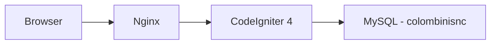
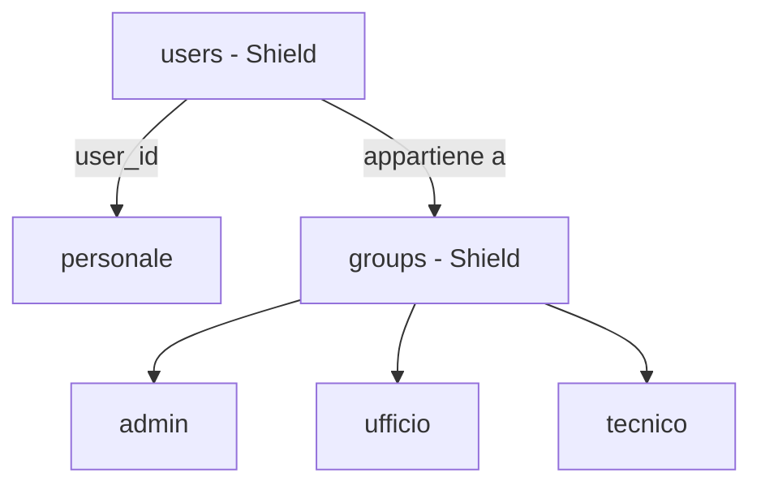

# Analisi del Software — [Colombini Snc]

## 1. Introduzione e contesto
### 1.1 Scopo del sistema
Gestionale interno per Colombini Snc, azienda specializzata nel 
trattamento acqua e costruzione piscine. Il sistema supporta la 
pianificazione e il tracciamento degli interventi tecnici presso 
i clienti, la gestione dei dipendenti e la visualizzazione del 
calendario lavori.
### 1.2 Obiettivi di business
- Sostituire la gestione manuale (carta/Google Calendar) degli interventi
- Ridurre le sovrapposizioni di appuntamenti
- Garantire puntualità nelle visite
- Gestione interventi programmati da abbonamenti
- Tenere traccia di materiali portati alle visite
- Dare ai tecnici visibilità sui propri interventi da smartphone
- Avere uno storico degli interventi per cliente
### 1.3 Stakeholder
| Ruolo | Descrizione | Accesso |
|-------|-------------|---------|
| Admin | Sviluppatore e titolari | Completo |
| Ufficio | Staff interno | Gestione interventi e calendario |
| Tecnico | Operatori sul campo | Visualizzazione e aggiornamento propri interventi |
| Cliente | Clienti aziendali | Accesso solo agli interventi a loro assegnati o richiesti da futuro portale|

### 1.4 Glossario
- **Intervento**: visita tecnica eseguita presso un cliente
- **Tecnico**: dipendente che esegue l'intervento sul campo
- **Stato intervento**: fase corrente (es. pianificato, in corso, completato)
- **Dispatcher**: figura dell'ufficio che pianifica e assegna gli interventi

## 2. Requisiti funzionali

### 2.1 Funzionalità

#### MVP
- Gestione utenti e permessi per ruolo
- Anagrafica clienti
- Anagrafica tecnici
- Creazione e assegnazione interventi
- Calendario interventi
- Aggiornamento stato intervento

#### Versioni successive
- Creazioni manutenzioni in abbonamento
- Dashboard dedicata ai tecnici con aggiornamento stato intervento
- Gestione magazzino
- Anagrafiche impianti
- Gestione creazione preventivi
- Sistema VRP con API OpenRouteService (OSR)
- Report e stampe
- Statistiche

### 2.2 Flussi operativi
### 2.3 Regole di business

## 3. Requisiti non funzionali

### 3.1 Performance
- Tempo di risposta pagine < 2 secondi
- Supporto a ~10 utenti simultanei

### 3.2 Sicurezza
- Autenticazione tramite sessione CI4
- Autorizzazioni per ruolo (admin, ufficio, tecnico, cliente)
- Protezione CSRF integrata in CI4
- Accesso tecnici limitato ai propri interventi

### 3.3 Disponibilità
- Sistema operativo sempre hostato su VPS esterna con dominio collegato
- Backup giornaliero del database MySQL su altra VPS esterna 
- Deploy su Nginx self-managed

### 3.4 Scalabilità
- Architettura sufficiente per ~10 tecnici e crescita clienti nel medio termine
- Nessun requisito di scalabilità orizzontale previsto, un singolo server Nginx è sufficiente per le dimensioni previste

## 4. Architettura del sistema

### 4.1 Stack tecnologico
- **PHP**: 8.2+
- **CodeIgniter**: 4.7.3
- **MySQL**: 8.x
- **AdminLTE**: 4.0.2 con Bootstrap 5.3.8
- **Frontend**: nessun bundler (Vite/webpack) — dipendenze gestite via npm + comando `assets:publish`

### 4.2 Diagramma dei componenti



### 4.3 Integrazioni esterne
- **OpenRouteService API**: calcolo percorsi ottimali per gli 
  spostamenti dei tecnici *(priorità bassa — versioni future)*

## 5. Interfaccia utente

### 5.1 Struttura e navigazione

**Cruscotto**
- Dashboard: riepilogo interventi da pianificare,
  presenze/assenze tecnici con link diretto al calendario sotto l'elenco intervento
- Calendario (pianificazione interventi con FullCalendar)

**Anagrafiche**
- Clienti: scheda con dati base, mappa OpenStreetMap su Leaflet,
  link Google Maps, storico interventi, note, materiali
- Tecnici

**Assistenza**
- Interventi: elenco + creazione
- Viaggi: interventi del giorno raggruppati per tecnico (solo staff)
  → click intervento → scheda cliente

**Amministrazione** *(solo admin)*
- Utenti e permessi

### 5.2 Requisiti mobile
- Interfaccia utilizzabile da smartphone dai tecnici sul campo
- Vista calendario semplificata su schermi piccoli
- Bottoni e touch target adeguati al tocco
- Viaggio del giorno filtrato per tecnico loggato con link diretto al cliente per poter aggiungere note e materiali futuri
- Aggiornamento stato intervento accessibile con pochi tap
- Chiusura intervento con generazione di pdf di rapportino, domanda se consegnati i materiali richiesti e indicati nell'intervento


## 6. Gestione dei dati

### 6.1 Entità principali
### 6.1 Entità principali

| Entità | Descrizione |
|--------|-------------|
| `users` | Gestita da CI4 Shield — autenticazione |
| `personale` | Dati anagrafici di tutto il personale (tecnici e staff),
                collegato a `users` tramite FK nullable |
| `clienti` | Anagrafica clienti con coordinate per mappa |
| `interventi` | Intervento tecnico presso un cliente |
| `tipi_intervento` | Tipologie di intervento |
| `stati_intervento` | Stati possibili dell'intervento |
| `viaggi` | Raggruppamento interventi per tecnico e giorno |
| `note` | Note operative collegate a cliente o intervento |
| `materiali` | Materiali utilizzati o da portare |

### 6.2 Autenticazione e autorizzazioni

**CI4 Shield** gestisce autenticazione e permessi:
- `users` — credenziali di accesso
- `groups` — ruoli (`admin`, `developer`, `ufficio`, `tecnico`, `cliente`)
- `users_groups` — relazione utente/gruppo

**`personale`** gestisce i dati operativi:
- Anagrafica (nome, cognome, telefono, colore calendario)
- Collegato a `users` tramite `user_id` FK nullable
- Utilizzato dall'applicazione indipendentemente da Shield



### 6.3 ER Diagram

### 6.4 Flussi di input/output
> Da compilare

### 6.5 Politiche di retention
> Da compilare

## 7. Piano di progetto

### 7.1 Milestone e fasi

#### ✅ v0.1.0 — Inizializzazione progetto
- Setup CI4 + AdminLTE 4 + Bootstrap 5.3.8
- Pipeline asset npm + assets:publish
- Layout admin con sidebar, navbar, dark mode
- Localizzazione italiana

#### ✅ v0.2.0 — Autenticazione
- Login/logout con CI4 Shield
- Gruppi utente: admin, staff, tecnici, clienti
- Protezione rotte con filtri Shield

#### ✅ v0.3.0 — Impostazioni base
- Navbar con dati utente loggato
- Pagina impostazioni con card

#### ✅ v0.4.0 — Anagrafica personale
- Migrazione: rimozione campi custom (nome, cognome, telefono) da users
- Creazione tabella `personale` con FK a `users`
- CRUD personale

#### ✅ v0.5.0 — Parametri generali
- Tabella `impostazioni` (class / key / value)
- Sede aziendale: nome, indirizzo, CAP, città, telefono, sito, logo, lat/lng + geocodifica
- Orari aziendali: inizio/fine giornata, pausa pranzo
- Durate standard interventi per tipo (sale, filtri, piscine, addolcitori, acquedotti, commerciale)

#### ✅ v0.6.0 — Profilo e visualizzazione changelog
- Visualizzazione changelog filtrata per `[DEV]` e `[APP]` a seconda del gruppo utente loggato
- Migrazione campo `ultima_versione_vista` su `users`; modal novità all'avvio con aggiornamento via AJAX
- Voce "Profilo" nel dropdown utente collegata alla scheda dipendente
- Pannello utente nella sidebar con nome, ruolo e link al profilo
- Restyling palette colori: navbar blu medio, sidebar-brand scura, separatore teal, versione nel footer
- Avatar rinviato a versione futura

#### ✅ v0.7.0 — Anagrafica clienti
- CRUD clienti completo (società e persone fisiche)
- Geocodifica automatica via Nominatim; `distanza_sede` calcolata con haversine ad ogni salvataggio
- Auto-assegnazione zona (Ventimiglia/Ceriale/Savona) da soglie longitudine configurabili in Parametri; zona manuale ha la precedenza
- ⚠️ **Zone da rivedere in versione futura**: il sistema attuale a 3 zone fisse è una macro-semplificazione — nella pratica le zone si suddividono ulteriormente (es. Varazze-Loano dentro Savona). Architettura target: tabella `zone` con `nome`, `lng_min`, `lng_max`, `ordine`; ogni cliente si auto-assegna alla zona il cui range contiene la sua longitudine. Stessa logica geolocalizzazione, numero zone libero, nomi configurabili dall'utente. Il pool del calendario raggrupperà per zona quando questo sarà implementato.
- Scheda cliente a tab: Anagrafica (attiva) · Interventi · Materiali (placeholder v0.8.0)
- Lista clienti con DataTables: ricerca testuale, ordinamento multi-colonna, paginazione
- `codice_esterno` per collegamento con software di contabilità esterno
- Denominazione e città forzate in maiuscolo nel model
- jQuery + DataTables via npm; sezione `styles` nel layout per CSS page-specific; tooltip Bootstrap inizializzati globalmente
- Guida di pagina per la sezione clienti rinviata a milestone futura

#### ✅ v0.8.0 — Interventi
- CRUD interventi: cliente, tecnico assegnato, genere, tipo intervento (entità separata con icona e durata default), stato, data pianificata, data scadenza, durata stimata, urgenza, note
- Generi intervento: `programmato`, `normale`, `sopralluogo`, `commerciale` (costanti nel model)
- Stati intervento: `da_pianificare` (default), `pianificato`, `in_corso`, `completato`, `annullato` (costanti nel model)
- `urgenza`: flag booleano (0/1) indipendente dal genere — qualsiasi intervento può essere marcato urgente
- `data_scadenza`: entro quando deve essere eseguito (distinta da `data_pianificata`); data pianificata senza orario — l'orario verrà impostato dal calendario (v0.12.0)
- `durata_stimata` in minuti, nullable — preleva il default dal tipo intervento selezionato
- Creazione da scheda cliente (link diretto, pre-compilato); sistema `from` per ritorno al tab Interventi dopo modifica/creazione/eliminazione
- Scheda cliente: pagina `show` read-only separata da `edit`; tab Interventi con DataTables e filtri rapidi; badge numero interventi nella lista
- `impianto_id` nullable (placeholder per v0.14.0; FK aggiunta subito per evitare ALTER futuri)
- Tabella `interventi_materiali` creata; gestione materiali nell'edit intervento; tab Materiali nella scheda cliente rinviato a v0.10.0

#### ✅ v0.9.0 — Magazzino base
- Tabella `categorie_articoli`: codice, nome, ordine — CRUD mini come tipi_intervento
- Tabella `articoli`: codice, descrizione, categoria_id, costo (prezzo acquisto), vendita (listino aziendale), giacenza (nullable — gestione avanzata in v0.16.0), attivo
- Categorie iniziali: Prodotti (cloro, sale, antialghe, acido…), Attrezzature (retini, test kit…), Apparecchiature (addolcitori…), Ricambi (futuro import da DB esterno)
- `articolo_id` nullable aggiunto a `interventi_materiali`: selezione da catalogo nel form materiali; descrizione libera ancora possibile per articoli ad hoc
- Selezione articolo nel form materiali: autocomplete/select per categoria + articolo, prezzo vendita auto-compilato

#### ✅ v0.10.0 — Materiali interventi e scheda cliente
- `genere` rinominato `priorità` con valori `programmato`, `normale`, `urgente` (rimossi `sopralluogo` e `commerciale`); migrazione con rimappatura valori esistenti
- Campo `stato` aggiunto a `interventi_materiali` (`da_portare` / `consegnato`); default `da_portare` all'inserimento
- Tom Select per selezione materiali: autocomplete da catalogo + testo libero in unico campo; `createOnBlur: true` per conferma senza premere Invio
- Scheda read-only intervento (`show`): dati + materiali con note e stato; link dal codice in index e scheda cliente
- Form edit intervento: tab materiali eliminata, sezione materiali inline scrollabile sotto il form
- Form nuovo intervento: sezione materiali con lista JS client-side (aggiungi/rimuovi prima del salvataggio); tutto inviato in una POST
- Tab Materiali nella scheda cliente: rowGroup per intervento, badge stato, link alla show intervento
- Sistema `from` esteso attraverso `MaterialiController`: `from` preservato nei redirect aggiunta/eliminazione materiale
- Contatore "Da portare" per intervento nella scheda cliente
- Appunti tecnici (da implementare in milestone futura): doppio click sulle righe DataTables, bottone × nell'header delle card, tabelle responsive

#### ✅ v0.11.0 — Materiali sospesi
- Un materiale può essere legato al **cliente** senza ancora un intervento, come promemoria "da portare al prossimo giro"
- `interventi_materiali`: `intervento_id` diventa nullable; si aggiunge `cliente_id` (sempre valorizzato)
- Eliminazione intervento: cascade delete sui materiali (hard delete — la cancellazione è sempre un errore, non un "rimanda"; il caso "rimanda" si gestisce tenendo l'intervento con stato `da_pianificare`)
- Scheda cliente — tab Materiali: sezione "Materiali da portare" con elenco sospesi + mini-form aggiunta rapida; i materiali con intervento restano nel rowGroup sottostante
- ✅ Implementato in v0.11.3: collegamento dei materiali sospesi a un nuovo intervento dal form di creazione

#### ✅ v0.11.1 — Redesign scheda cliente
- Layout verticale scrollabile a sezioni sticky (Anagrafica · Materiali da portare · Interventi) — rimosso il sistema a tab Bootstrap
- Header compatto con denominazione, badge stato, azioni e back link
- Nav anchor laterale (≥1400px) con highlight sezione attiva via IntersectionObserver
- Nuova pagina storico materiali `/clienti/{id}/materiali`: sospesi + materiali per intervento raggruppati con group header e spacer row; Qtà in prima colonna per indentazione visiva

#### ✅ v0.11.2 — Chiudi intervento + fix dark mode
- Pulsante "Chiudi intervento" nella scheda read-only: modal con domanda sui materiali (Sì/No)
- Materiali non consegnati → tornano sospesi con nota `[Da INT-XXX]`
- Rimosso `table-light` da tutti i `<thead>` (dark mode)
- ID DB visibile on hover su righe e cross-reference nelle view

#### ✅ v0.11.3 — Sospesi nel nuovo intervento
- Nel form "Nuovo intervento", dopo la selezione del cliente, se esistono materiali sospesi appare una sezione con la lista e checkbox per selezionare quali portare
- I sospesi selezionati vengono **spostati** (non copiati): al salvataggio viene impostato `intervento_id` sulla riga esistente — nessuna riga nuova creata
- I sospesi non selezionati rimangono sospesi e continuano ad apparire nella scheda cliente
- **Edge case — eliminazione intervento**: prima del hard delete, i materiali dell'intervento vengono liberati (`intervento_id = NULL`) così sopravvivono al CASCADE e tornano sospesi automaticamente
- La sezione sospesi è visibile solo se il cliente ha almeno un sospeso; non appare se cliente non ancora selezionato

#### ✅ v0.12.0 — Calendario
- FullCalendar 6 via npm (bundle global + locale IT); `public/css/calendario.css` dedicato con dark mode override via `--fc-*`
- Griglia con viste giorno/settimana/mese; slot 07:00–20:00; eventi colorati per tecnico (`personale.colore`)
- Pool "Da pianificare": sidebar affiancata, interventi raggruppati per zona geografica con barra colorata collassabile
- Drag & drop dal pool → modal pianifica (tecnico + ora) → AJAX POST → stato `da_pianificare` → `pianificato`
- Click evento → modal dettaglio; drag interno → sposta data/ora; bottone × → annulla pianificazione e riporta nel pool
- Filtro pill per tecnico; `data_pianificata` a `datetime-local` in form edit; descrizione intervento resa obbligatoria
- Elenco interventi: filtri "Da pianificare" / Pianificati / Completati / Annullati ("In corso" accorpato a Pianificati fino a v0.13.0)
- *Nota: il pool mostra tutti gli interventi `da_pianificare` senza filtro per periodo — variante più semplice e operativamente più utile della specifica originale*
- *Nota: milestone anticipata rispetto ad Abbonamenti perché ne è prerequisito operativo*

#### ✅ v0.13.0 — Viaggi
- Vista giornaliera di tutti gli interventi pianificati, ordinati per ora e raggruppati per zona geografica (stessa palette colori dell'index clienti e del pool calendario)
- Navigazione per data con frecce e selettore; bottone "Oggi"
- Materiali "da portare" come lista puntata nella cella tipo/descrizione; quantità sempre mostrata
- PDF foglio di viaggio (dompdf 3.1.5): A4 landscape, intestazioni zona colorate, colonna Firma
- `InterventiMaterialiModel::normalizza()`: copia automatica di `articoli.descrizione` al `$beforeInsert`; seeder backfill per i record esistenti
- *Nota: la vista è di sola lettura (nessun salvataggio a DB) — gli interventi sono già in DB; la stampa fisica è lo snapshot per il campo*
- *Nota: la vista per tecnico mobile è rinviata a versione successiva*

#### ✅ v0.14.0 — Abbonamenti
- **Flusso invertito rispetto alla concezione iniziale**: l'abbonamento nasce a livello di cliente (non più come effetto collaterale silenzioso del salvataggio di un intervento) e da esso vengono generati gli interventi collegati
- Genere/priorità intervento `programmato` rinominato `abbonamento`; non modificabile dalla scheda intervento quando l'intervento è già collegato a un abbonamento (il campo è "di proprietà" dell'abbonamento, non dell'intervento)
- Nuova FK **`abbonamento_id` nullable diretta su `interventi`** (one-to-many: un abbonamento → molti interventi). Sostituisce la precedente ipotesi di tabella pivot `abbonamenti_interventi`, non più necessaria: un intervento appartiene a un solo abbonamento
- Form/UI di creazione abbonamento (a livello cliente): raccoglie data inizio/fine validità, prezzo totale e uno o più **periodi di frequenza**
- **`abbonamenti_periodi`**: un abbonamento ha N periodi, ciascuno con `data_inizio`, `data_fine`, `frequenza`, `con_pulizia_fondo`. Sostituisce il campo `frequenza` singolo sull'abbonamento. La generazione batch itera sui periodi in sequenza
- Frequenze per periodo: settimanale, quindicinale, mensile, bimestrale, trimestrale, semestrale, annuale
- `con_pulizia_fondo TINYINT` su `abbonamenti_periodi`: opzione specifica piscine, visibile nel form solo quando il tipo abbonamento è piscine. Campo booleano, default 0
- Stati abbonamento: `attivo`, `sospeso`, `scaduto`, `disdetto` (costanti nel model)
- `durata_mesi` calcolata automaticamente nel model
- `abbonamento_precedente_id` per catena storica (navigabile con CTE ricorsiva MySQL 8+)
- `prezzo` = totale abbonamento, non per visita
- **Generazione interventi**: tutti gli interventi previsti dalla durata dell'abbonamento vengono creati in un'unica passata al momento della creazione dell'abbonamento (batch, non uno alla volta a chiusura del precedente)
- Per **ogni** intervento generato: `data_pianificata = NULL` e `data_scadenza` = fine del sotto-periodo di competenza; stato iniziale `da_pianificare`. Il giorno/orario preciso viene assegnato in seguito dal dispatcher tramite il pool "Da pianificare" del Calendario
- Scheda cliente: la sezione Abbonamenti mostra **una riga per abbonamento** (contratto). Il dettaglio dei periodi è nella scheda abbonamento dedicata
- `tipi_intervento.abbonabile TINYINT`: flag che indica se un tipo può essere usato negli abbonamenti; la select di creazione abbonamento mostra solo i tipi con `abbonabile = 1`
- Spec dettagliata in `docs/abbonamenti_spec.md`
- *Fix v0.14.0: `InterventiModel::normalizza()` usava `!isset()` che è `true` anche con `id = null` in bulk UPDATE → duplicati su UNIQUE constraint; corretto con `!array_key_exists()`*
- *Fix v0.14.0: disdetta abbonamento avvolta in transazione; interventi figli in `da_pianificare` marcati `annullato` in batch*
- *Fix v0.14.0: subquery `num_interventi` in `ClientiModel` filtrata su `abbonamento_id IS NULL AND stato NOT IN ('completato','annullato')`*

#### ✅ v0.14.1 — Fix frecce DataTables
- *Fix: DataTables 2.x imposta `flex-direction:row-reverse` su `div.dt-column-header` per le colonne `dt-type-numeric`, mettendo le frecce a sinistra del testo. Override a `flex-direction:row` via CSS per i `<th class="text-center">` (Interventi e Zona in lista clienti)*

#### ✅ v0.15.0 — Abbonamenti: prossima visita, visite extra, pulizia fondo
- **Next-by-scadenza**: alla chiusura di un intervento con materiali "non portati", il sistema cerca il prossimo intervento aperto dello stesso abbonamento (per `data_scadenza`) e riassegna i materiali direttamente su di esso invece di lasciarli sospesi sul cliente. Se non esiste un prossimo univoco, il comportamento precedente (materiali sospesi sul cliente) viene preservato
- **Visite extra**: dalla scheda abbonamento si può creare un intervento aggiuntivo fuori piano (`extra = 1`, `priorita = 'abbonamento'`); tipo intervento pre-compilato in readonly; sincronizzazione bidirezionale `data_pianificata` ↔ `data_scadenza` via JS
- **Flag pulizia fondo**: ogni intervento generato eredita `pulizia_fondo` dal campo `con_pulizia_fondo` del periodo; l'operatore può modificarlo al momento della chiusura (checkbox visibile solo per tipi con `ha_pulizia_fondo = 1`)
- Migration `AddExtraAndPuliziaFondoToInterventi`: aggiunge `extra TINYINT(1) DEFAULT 0` e `pulizia_fondo TINYINT(1) DEFAULT 0` su `interventi`

#### ✅ v0.16.0 — Diario interventi
- **Diario di note datate** per ogni intervento: ogni voce ha `data_nota`, `testo` e autore. La cronologia evita di sovrascrivere il campo `note` unico quando si registrano aggiornamenti progressivi (caso d'uso: aperture piscine e lavori multi-visita, es. "15.06 vuotata → 20.06 in riempimento → 24.06 avviato")
- Scrittura nella modifica intervento, accanto ai materiali (note e materiali si trascrivono insieme); sola lettura nella scheda read-only
- Tabella `interventi_note` (FK `intervento_id` CASCADE) + `InterventiNoteModel`; metodi `aggiungiNota()`/`eliminaNota()` nel controller con sistema `from`
- *Nota: il campo `note` legacy dell'intervento resta per ora accanto al diario — da valutare se renderlo ridondante in futuro*
- *Mini-edit di una nota esistente: rinviato a versione futura*

#### ✅ v0.16.1 — Sezioni interventi per area
- **Lista interventi divisa per area** dal menu treeview: Generici / Piscine / Addolcitori. View unica parametrica via `?sezione`, senza nuove rotte né view duplicate; ogni sezione mostra solo la propria categoria (i Generici includono gli interventi senza tipo)
- Campo `categoria` su `tipi_intervento` (default `generale`/`Generici`); flag `apertura` / `chiusura` su `interventi` con guardia di mutua esclusione; **fase** ordinaria/apertura/chiusura nel form, visibile solo per i tipi Piscine
- Pill **Aperture**/**Chiusure** (Piscine) e **Abbonamenti** (Piscine/Addolcitori); badge **Apertura**/**Chiusura** in lista, scheda intervento e scheda cliente
- Scheda cliente: badge **Extra** in tabella interventi; sezione **Interventi** spostata sopra **Abbonamenti**; fix ordinamento al click sugli input di ricerca
- *Idee future correlate: dashboard riepilogativa dei flag; "Da pianificare per periodo" sugli abbonamenti*

#### ✅ v0.17.0 — Cantieri

Un **cantiere** raggruppa più interventi legati a un unico progetto per un cliente (nuova costruzione o ristrutturazione). Si distingue dagli interventi "standalone" (manutenzioni, abbonamenti) che non appartengono a nessun progetto.

**Modello dati implementato**
- Tabella `cantieri`: `cliente_id` FK RESTRICT, `titolo`, `tipo` VARCHAR (nuova_costruzione / ristrutturazione), `tipo_intervento_id` nullable FK SET NULL (default pre-compilazione form), `stato` VARCHAR (aperto / sospeso / chiuso), `data_inizio`, `data_fine_prevista`, `note`, campi standard
- Tabella `cantieri_note`: diario cronologico datato — `cantiere_id` FK CASCADE, `data_nota`, `testo`, campi standard. Stessa struttura di `interventi_note`
- Colonna `cantiere_id INT UNSIGNED NULL FK → cantieri.id RESTRICT` su `interventi` (gemella di `abbonamento_id`)
- Decisione chiave: note e interventi sono fratelli figli del cantiere, non collegati tra loro. Le note sono prosa libera; quando una nota diventa lavoro concreto si crea un intervento e lo si aggancia al cantiere

**Flusso operativo**
1. Si apre un cantiere sul cliente con titolo, tipo e tipo intervento predefinito (opzionale)
2. Si aggiungono note al diario man mano che avanza il lavoro (prosa libera datata)
3. Quando un appunto diventa lavoro concreto, si crea un intervento dalla scheda cantiere — il tipo viene pre-compilato dal default del cantiere ma resta modificabile
4. L'intervento entra nel pool "Da pianificare" del Calendario e segue il flusso normale
5. Il cambio di stato del cantiere (aperto / sospeso / chiuso) non produce effetti a cascata sugli interventi

**Navigazione implementata**
- Lista cantieri globale (`/cantieri`) — voce menu laterale tra Abbonamenti e Calendario
- Scheda cantiere: header con azioni cambio-stato + bottone elimina (bloccato se ci sono interventi collegati); sezione interventi collegati; diario con mini-form aggiungi nota
- Scheda cliente: sezione **Cantieri** con indice sottile — contatore "⚠ N da pianificare", anteprima ultima nota, link Apri. Gli interventi di cantiere sono **esclusi** dalla lista interventi piatta della scheda cliente (opzione A — si vedono solo sotto il loro cantiere)
- Scheda intervento e form modifica: banner con link al cantiere se collegato
- Calendario — modal pianifica: avviso inline (non bloccante) se la data pianificata supera la `data_scadenza` dell'intervento; avviso rosso per urgenti, giallo per normali

#### ✅ v0.18.0 — Dashboard role-aware
- **Dashboard adattata al ruolo**: admin e ufficio vedono conteggio interventi pianificati oggi (link a calendario e foglio di viaggio) e lista urgenti non pianificati con badge contatore
- **Ufficio**: sezione aggiuntiva abbonamenti in scadenza nei prossimi 30 giorni, ordinati per data con badge giorni rimasti (rosso ≤7gg, giallo ≤15gg, grigio oltre)
- **Tecnico**: sezione personale con i propri interventi di oggi (ora, cliente, indirizzo) e i propri urgenti non pianificati; chi è sia admin che tecnico vede entrambe le sezioni
- `DashboardController` riscritto con metodi privati `caricaDatiUfficio()` / `caricaDatiTecnico()`
- Fix: `COALESCE(ragsoc, TRIM(CONCAT_WS(' ', cognome, nome)))` per denominazione cliente; fix validazione `data_pianificata` a `valid_date[Y-m-d\TH:i]` + conversione `T`→spazio in `normalizza()`
- *Rimandato a versione futura: report PDF interventi/abbonamenti; statistiche interventi per tipo/periodo (presenze/assenze tecnici implementate in v0.22.0)*

#### ✅ v0.19.0 — Adattamento mobile
- **Dashboard tecnico mobile**: agenda dei prossimi 3 giorni (oggi/domani/dopodomani) con orario, cliente, indirizzo, materiali da portare e mappa Leaflet (OpenStreetMap) con link a Google Maps; i tecnici "puri" vengono indirizzati a questa vista
- **Sidebar role-aware**: i tecnici puri vedono solo Dashboard, Clienti, Calendario, Interventi (helper `acl::is_solo_tecnico()`)
- **Tabelle responsive**: estensione DataTables Responsive (colonne collassabili) su Clienti, Interventi, Articoli; asset DataTables centralizzati in partial condivisi
- **Filtri liste** adattati a mobile (wrap invece di sforare)
- **Calendario mobile**: vista Giorno, barra essenziale, pool comprimibile a icona (desktop) e nascosto (mobile); tooltip esplicativo su "Scadenze aperte"
- **Foglio di viaggio**: tabella scrollabile su mobile
- *Nota: pianificazione da mobile via scheda intervento; il pool drag&drop resta desktop. Adattamento completo mobile-first rimandato al Portale tecnici (vedi 7.1.1)*

#### ✅ v0.20.0 — Guida contestuale
- **Sistema di help per sezione**: pulsante `?` nella navbar che apre, in un modal (fullscreen su mobile), la guida della sezione corrente; compare solo se esiste `app/Views/help/<sezione>.php`. Il layout legge `$help_sezione` passato dal solo `index()` di ogni controller
- **Guide scritte** per: dashboard (ufficio e tecnico), personale, clienti, calendario, interventi, abbonamenti, cantieri, articoli, impostazioni
- **Fix changelog/novità**: convertitore Markdown inline (`changelog_inline()`) per grassetto/corsivo/`code` nelle voci (prima compariva la sintassi `**...**`)
- **Calendario**: pool compresso ridotto a pulsante-icona invece che a barra larga; la larghezza inline del resize non sovrascrive più lo stato compresso

#### ✅ v0.20.1 — Guida sotto-sezioni
- Guide aggiunte per le sotto-pagine di Impostazioni (Tipi intervento, Categorie articoli, Utenti) e per il Foglio di viaggio; `help_sezione` sui rispettivi `index()`

#### ✅ v0.21.0 — Promemoria e avvisi
- **Promemoria**: eventi aziendali ad-hoc con data/ora, gestiti dall'ufficio dal Calendario (evento viola, sola lettura per i tecnici). Tabella `promemoria`, `PromemoriaModel`, `PromemoriaController`
- **Campanella avvisi** in navbar come View Cell `AvvisiCell` (predisposta ad aggregare le future notifiche): promemoria divisi in "Questa settimana" / "Prossimi giorni", link al calendario sul giorno
- **Dashboard** riorganizzata a info-box + card: contatori sintetici, elenco interventi di oggi (con tecnico), promemoria in arrivo a due fasce
- Fix: `data_pianificata` con ora (`datetime-local`) nel form nuovo intervento; `NULLIF` su `ragsoc` per la denominazione delle persone fisiche
- *Nota: notifiche vere (tabella dedicata + stato "visto" per-utente) rimandate; i promemoria scadono per data*

#### ✅ v0.21.6 — Promemoria di oggi: modal e stato "letto"
- Modal informativa forzata con i promemoria di oggi ad ogni accesso (stile Google Calendar); il bottone "Ho letto" salva il dismiss su tabella dedicata `promemoria_dismiss`, per utente e indipendente da browser/dispositivo
- Campanella e dashboard: fascia "Oggi" (al posto di "Questa settimana") sempre visibile per l'intera giornata anche a orario passato; spunta verde sui promemoria già letti, che restano comunque visibili
- `data_ora_fine` di default = inizio + 1 ora quando non specificata
- *Nota: risponde parzialmente alla nota di v0.21.0 sullo stato "visto" per-utente — resta specifico ai promemoria, non ancora una tabella `notifiche` generica*

#### ✅ v0.21.7 — Fix created_by/updated_by in tutti i model
- Tutti i model con `normalizza()` usavano `session()->get('user_id')` (sempre `null` in questo progetto) invece dell'helper Shield `user_id()` — bug scoperto inizialmente su `PromemoriaModel`, poi esteso a tutti gli altri 12 model con lo stesso problema (`PersonaleModel`, `AbbonamentiModel`, `AbbonamentiPeriodiModel`, `ArticoliModel`, `CantieriModel`, `CantieriNoteModel`, `CategorieArticoliModel`, `ClientiModel`, `InterventiModel`, `InterventiNoteModel`, `InterventiMaterialiModel`, `TipiInterventoModel`) — `created_by`/`updated_by` ora popolati correttamente in tutto il gestionale

#### ✅ v0.22.0 — Assenze personale
- **Sezione Assenze nella scheda dipendente** (Anagrafiche → Personale): registrazione ferie/malattia/permesso/altro con data inizio/fine (giornata intera) e note facoltative; gestione riservata a ufficio/admin/developer
- Sovrapposizioni tra assenze dello stesso dipendente: avviso non bloccante, il salvataggio procede comunque (es. malattia durante le ferie)
- **Calendario**: le assenze compaiono come eventi arancioni nella riga "all-day" (`allDaySlot` abilitato, prima disattivato); non editabili da lì, si gestiscono solo dalla scheda Personale
- Avviso non bloccante nel modal "Pianifica" se si assegna un intervento a un tecnico assente in quella data
- **Dashboard** (admin/ufficio): info-box "Assenti oggi" e card con l'elenco di chi è assente oggi (nome, tipo assenza), link alla scheda Personale
- Tabella `assenze` (FK `personale_id` CASCADE, non `users` — coerente con `interventi.tecnico_id`); `AssenzeModel`
- Nuovo flashdata `warning` (alert giallo) nel layout, usato per le sovrapposizioni
- *Fuori scope per ora: saldo ferie maturate/residue, report PDF*

#### ✅ v0.23.0 — Mappa in scheda cliente
- **Sezione Posizione nella scheda cliente**: mappa Leaflet col punto del cliente, link "Apri in Google Maps"; pallino rosso fisso non modificabile per la sede aziendale
- **Correggi posizione sempre disponibile** (non solo su geocodifica fallita): click sulla mappa o drag del pin, poi salvataggio con form POST dedicato (`ClientiController::aggiornaPosizione()`, sotto-risorsa come `aggiungiAssenza()`/`aggiungiNota()`)
- Se manca una posizione precisa, centraggio provvisorio (non salvato) sulla città indicata via Nominatim, altrimenti sulla sede aziendale
- Campo **Nazione** (nuovo/modifica cliente) da testo libero a select con Italia/Francia predefinite (`ClientiModel::NAZIONI_PREDEFINITE`) + opzione "Altra…"
- Fix bug Leaflet preesistente: `L.Icon.Default._getIconUrl()` raddoppiava l'URL delle icone marker (anche in `dashboard/tecnico.php`, stesso codice copiato)
- Guida della sezione Clienti aggiornata
- *Vedi `docs/spec/mappa_cliente_spec.md` per il dettaglio delle decisioni*

#### ✅ v0.23.1 — Piccoli ritocchi
- Scheda intervento: data pianificata mostra anche l'ora (`d/m/Y H:i`), prima solo il giorno
- Query denominazione cliente unificate su un solo pattern SQL (`CASE WHEN tipo`) in 4 metodi che usavano ancora `COALESCE(NULLIF(ragsoc,''),...)`, equivalente ma diverso dal pattern già in uso ovunque
- Chiusi anche senza modifiche di codice: bottoni PDF/Stampa foglio di viaggio su mobile (già a posto da v0.19.0, nota superata) e layout a blocchi impilati mobile (non serve più, va bene lo scroll orizzontale attuale)

#### ✅ v0.24.0 — Stampe PDF: scheda Cliente e Cantiere
- **Scheda Cliente**: documento operativo essenziale — anagrafica, materiali sospesi, interventi da pianificare/pianificati (visite da abbonamento limitate al mese corrente), abbonamento attivo, cantieri aperti/sospesi. Niente storico completo, niente mappa (solo link "Apri in Google Maps")
- **Scheda Cantiere**: riepilogo completo (non l'essenziale) — anagrafica cliente e dati cantiere completi affiancati, diario integrale, tutti gli interventi collegati in ogni stato con i relativi materiali portati/da portare
- Pattern comune: view HTML/CSS dedicata per dompdf (niente flexbox/grid), palette ripresa dal vecchio progetto (accento blu, tabelle etichetta/valore, badge di stato), stream inline
- Rimosso codice morto: secondo gruppo di impostazioni azienda mai raggiungibile da nessuna view (`Azienda.ragione_sociale`/`partita_iva`/`logo_path`)
- *Vedi `docs/spec/stampa_cliente_pdf_spec.md` e `docs/spec/stampa_cantiere_pdf_spec.md`. Stampe di Intervento e Abbonamento rimandate, da pianificare senza scadenza precisa*

#### ✅ v0.24.1 — Blocco cancellazione cliente e view di consultazione
- Cancellare un cliente con interventi/cantieri/abbonamenti ancora collegati mostra ora un messaggio chiaro sui record da rimuovere prima, invece dell'eccezione grezza del DB
- `ClientiModel::relazioniBloccanti()`: scopre da `information_schema` quali tabelle hanno FK RESTRICT/NO ACTION su `clienti.id`, si aggiorna da solo con le future tabelle collegate ai clienti
- Nuove view di sola lettura per query manuali a DB: `v_abbonamenti_clienti`, `v_abbonamenti_clienti_interventi`, `v_interventi_clienti`

#### ✅ v0.24.2 — Dettaglio intervento anche dal pool di pianificazione
- Click su una card nel pool "Da pianificare": apre lo stesso modal di dettaglio usato per gli eventi pianificati nel calendario (tipo, tecnico, data, stato, descrizione, scadenza), con bottoni Modifica/Apri scheda
- Modal dettaglio intervento (pool e calendario): mostra anche i materiali da portare, quando presenti
- `CalendarioController::index()`/`eventi()` raggruppano i materiali per intervento riusando `InterventiMaterialiModel::daPortarePerInterventi()`, stesso pattern di `ViaggioController`
- Fix bordo colorato del modal spezzato tra header e body: spostato da `#modal-header` a `#modal-content`

#### ✅ v0.24.4 — Filtri pill e ricerca DataTable per Abbonamenti nella scheda cliente
- Bottoni filtro (Attivi/Sospesi/Scaduti/Disdetti/Tutti) + ricerca full text DataTables per gli Abbonamenti nella scheda cliente, come già presente per Interventi
- Nuovo file condiviso `public/js/pill-filtri.js`: listener generico basato su configurazione JSON nel markup (`data-pill-filtri`), sostituisce la logica di filtro duplicata per tabella; anche la sezione Interventi della scheda cliente migrata al nuovo sistema
- Non ancora estesa alla lista Interventi globale (richiede generalizzare il file da 2 a N colonne per filtro) — rimandato

#### ✅ v0.24.5 — Fix visibilità interventi da cantiere nella scheda cliente
- Gli interventi collegati a un cantiere ora compaiono anche nella lista "Interventi" della scheda cliente (badge "Cantiere: nome"), invece di sparire non appena uscivano dallo stato "da pianificare"
- `InterventiModel::perCliente()` non esclude più `cantiere_id IS NULL`; `ClientiController::pdf()` mantiene il filtro solo per sé, per non duplicarli nel PDF (già elencati nel blocco del proprio cantiere)

#### ✅ v0.24.6 — Fix zoom da rotella sulla mappa nella scheda cliente
- Scorrere la pagina con il mouse sopra la mappa Leaflet non zooma più la mappa per errore: lo zoom da rotella si attiva solo cliccando prima sulla mappa (overlay con messaggio), disattivato di nuovo appena il mouse esce
- Fix stacking context: `#mappaCliente` necessitava di uno `z-index` esplicito insieme al `position: relative` impostato da Leaflet, altrimenti i pannelli interni (tile, controlli zoom) competevano con l'overlay invece di restarne sempre sotto

#### ✅ v0.24.7 — Fix leggibilità righe urgenti in dark mode
- Le righe `table-danger` (interventi urgenti) nelle liste Interventi e Viaggio ora restano leggibili in dark mode: prima il testo delle colonne con classi `.text-body`/`.text-muted` risultava chiaro su sfondo rosa chiaro rimasto invariato, perché Bootstrap/AdminLTE definisce `.table-danger` solo per la modalità chiara
- Nuova regola `[data-bs-theme="dark"] .table-danger` in `custom.css` con variabili Bootstrap ridefinite per sfondo rosso scuro e testo chiaro

#### ✅ v0.24.8 — Dark mode: altri fix di leggibilità + tabella Cantieri con DataTable
- Stesso problema di v0.24.7 in altri due punti: `.text-muted` dentro `.bg-light` (badge date "Scadenze aperte") e le intestazioni `table-light` (Cantieri/Viaggio/Abbonamenti/Interventi cliente), entrambi fissi in modalità chiara — nuove regole dark-mode dedicate in `custom.css`
- Scheda cliente: la tabella Cantieri passa a DataTable con filtri pill Aperti/Sospesi/Chiusi/Tutti, stesso pattern già usato per Interventi e Abbonamenti (colonna nascosta con stato raw, `pill-filtri.js`)

#### ✅ v0.24.9 — Riordino voci di menu
- Voce "Calendario" spostata in cima al menu laterale, sopra "Anagrafiche"

#### ✅ v0.24.10 — Ritocchi calendario e form interventi
- Pool "da pianificare": ordinamento semplificato a urgenza + data di inserimento; nuovo campo "Creato il" nel dettaglio calendario e nella scheda intervento
- Descrizione intervento precompilata dal tipo scelto (editabile); impostare la data pianificata su un intervento "da pianificare" lo porta automaticamente a "pianificato"
- Fix contrasto testo sui colori profilo dipendente (calendario e scheda personale): nuovo helper `colore_testo()` (YIQ) sceglie nero o bianco in base allo sfondo

#### ✅ v0.24.11 — Sottogruppi generico/cantiere/abbonamento nel pool calendario
- Dentro ogni zona del pool "da pianificare", gli interventi sono ora raggruppati anche per tipo (Generici/Cantieri/Abbonamenti), ciascuno con intestazione pieghevole e conteggio proprio
- `CalendarioController::index()`: `$poolPerZona` ristrutturato a `zona => blocchi[]` già ordinati e filtrati (skip dei sottogruppi vuoti); `$totaliPerZona` precalcolato per i badge di zona
- `InterventiModel::poolDaPianificare()`: selezionati anche `cantiere_id`/`abbonamento_id` per la classificazione

#### ✅ v0.24.12 — Fix visibilità changelog: solo developer vede le righe [DEV]
- Rimosso `admin` dal controllo di `admin.php` che decide la visibilità delle righe `[DEV]` nel modal Novità e nel Changelog — ora solo il ruolo `developer` le vede, coerente con `CLAUDE.md`

#### ✅ v0.24.13 — Blocco tecnico assente su interventi + notifica conflitti retroattivi
- Assegnare un tecnico assente a un intervento è ora bloccato lato server in creazione/modifica/drag calendario, con alert live nei form (`nuovo.php`, `edit.php`, modal Pianifica) che disabilita il salvataggio; `InterventiController::erroreAssenzaTecnico()` centralizza il controllo, riusato da `store()`/`update()`/`pianifica()`/`CalendarioController::sposta()`
- In modifica il blocco scatta solo se tecnico o data pianificata vengono attivamente cambiati — un conflitto già presente all'apertura (nato da un'assenza inserita dopo) non impedisce di salvare altri campi
- Caso complementare — assenza inserita *dopo* la pianificazione: nuova card dashboard "Interventi in conflitto" (`InterventiModel::inConflittoConAssenze()`, query live senza tabelle nuove) con link diretto a `edit` per riassegnare; `PersonaleController::aggiungiAssenza()` segnala subito l'eventuale conflitto nello stesso avviso delle sovrapposizioni tra assenze
- Fix visita extra da abbonamento: il campo data pianificata era nascosto per errore rispetto allo spec originale (`abbonamenti_next_visita_spec.md` §4) — ora visibile e facoltativo come previsto; descrizione precompilata lato controller (il select tipo intervento è disabled in questo flusso, l'auto-precompilazione JS non scattava)
- Scheda abbonamento: badge "Extra" nella tabella interventi collegati per distinguere le visite extra dalle occorrenze regolari del piano

#### ✅ v0.24.14 — Spunta "completato" sul calendario + fix icone tipo intervento
- Calendario: gli interventi completati mostrano una spunta verde (`bi-check-circle-fill`) in alto a sinistra sull'evento
- Fix: le icone dei tipi di intervento (`tipi_intervento.icona`, classi Font Awesome) venivano renderizzate nel calendario con il prefisso `bi` di Bootstrap Icons invece di `fas` — non comparivano mai, in nessuno dei tre punti che le usano (evento, pool, modal dettaglio); corretto anche il fallback lato server
- Refactor `eventContent` (JS): da concatenazione di stringhe a template literal, stili spostati in classi CSS dedicate (`calendario.css`)

#### ✅ v0.24.15 — Orario suggerito nel modal di pianificazione
- Modal "Pianifica" (drag dal pool): scelto un tecnico, l'orario si precompila subito dopo la fine del suo ultimo intervento già pianificato in quella data (default comodo, sempre modificabile)
- Replica lo stesso algoritmo già usato nel vecchio progetto (`apiOrarioSuggerito`), senza la parte su orari/pause per tecnico che qui non esiste — usa l'inizio giornata configurato in Impostazioni
- Fix: il default `oraInizio` del modal era fisso a `'08:00'` invece di leggere l'impostazione azienda `Azienda.orario_inizio`

#### ✅ v0.24.16 — Fix modal Novità e Promemoria di oggi sovrapposti
- I modal auto-aperti all'accesso (Novità di versione, Promemoria di oggi) ora si mostrano in sequenza invece che sovrapposti: nuova coda JS `enqueueModal` in `layouts/admin.php`, usata anche da `Cells/promemoria_oggi.php`

#### ✅ v0.24.17 — Fix: modal Novità/Changelog vuoto sulle versioni solo [DEV]
- Quando l'ultima versione ha solo righe `[DEV]` (nessuna `[APP]`), il modal Novità e il Changelog mostrano un avviso invece di restare vuoti — bug mai risolto davvero nonostante un tentativo precedente (v0.24.12) che ne aveva solo mascherato il sintomo
- `changelog_helper.php::changelog_to_html()`: aggiunto il ramo `else` mancante per `$appItems` vuoto

#### ✅ v0.24.18 — Vai a data: click sul titolo del calendario apre il datepicker nativo
- Cliccando il titolo del calendario si apre il datepicker nativo del browser/dispositivo per saltare direttamente a una data, su mobile e desktop
- Input `type="date"` invisibile, aperto con `showPicker()` (fallback `click()`), riposizionato dinamicamente sopra al titolo a ogni click

#### ✅ v0.24.19 — Foglio di viaggio: layout a card, filtro tecnico e PDF ristilizzato
- Pagina Foglio di viaggio (chiude il punto 9.R degli appunti riunione) racchiusa in un'unica card coerente con lo stile del resto del gestionale, al posto dei blocchi "nudi" fuori pattern
- Nuovo filtro a pill per tecnico (stesso pattern del Calendario): nasconde righe e zone senza interventi del tecnico selezionato; il bottone PDF segue il filtro attivo generando il foglio solo per quel tecnico
- PDF ristilizzato riprendendo il pattern grafico già usato per le stampe Cliente/Cantiere (a sua volta ripreso dal vecchio progetto): header con logo, badge priorità colorati, righe urgenti evidenziate
- `InterventiModel::perGiornata()` accetta un `$tecnicoId` opzionale; `ViaggioController` carica l'elenco tecnici e propaga il filtro al PDF

#### ✅ v0.24.20 — Fix: "Vai a data" del calendario non funzionava su mobile (iOS Safari/Chrome)
- Il tap sul titolo del calendario ora apre correttamente il datepicker nativo su desktop, Safari iOS e Chrome iOS — su mobile prima non succedeva nulla (Chrome) o compariva anche un pill grigio indesiderato (Safari)
- L'input `type="date"` invisibile non viene più riposizionato via `getBoundingClientRect()` al click: è incollato nel DOM dentro il contenitore del titolo e dimensionato con CSS puro (`position:absolute; inset:0`), sempre allineato ad ogni riflusso del layout
- `showPicker()` chiamata da un listener attaccato direttamente sull'input (non delegato da un ancestor): i browser iOS non-Safari (Chrome/Firefox) rifiutavano la chiamata delegata con `NotAllowedError`, non riconoscendola come gesto utente diretto

#### ✅ v0.24.21 — Calendario: pool collassato di default, JS in file esterno, fix crash sul drag
- Pannello "Da pianificare": il secondo livello (tipi di intervento) si apre già chiuso, restano visibili solo le zone
- Fix: `TypeError` in console trascinando un evento sul calendario, causato dal Tooltip di Bootstrap in conflitto con l'elemento "mirror" creato da FullCalendar durante il drag — tooltip ora saltato su `info.isMirror`
- Refactor: le ~650 righe di JS inline della view spostate in `public/js/calendario.js`, dati da PHP raccolti in un unico oggetto `window.CalendarioConfig`

#### ✅ v0.24.22 — Calendario: barra "Attenzione" con scadenze in ritardo, appuntamenti mancati e interventi fermi
- Sostituisce la barra "Scadenze aperte" (chiude il punto 7.R degli appunti riunione): tre pill collassabili — Non completato, In ritardo, Fermo — con conteggio e tooltip per motivo
- Click su un intervento evidenzia (scroll+flash) la card/evento in pagina senza uscire dal calendario; doppio click (tap su mobile) apre la scheda
- `InterventiModel::scadenzeInRitardo()` sostituisce `scadenzeAperte()`: motivo e giorni calcolati in PHP, gli abbonamenti generati in blocco sono esclusi dal criterio "fermo" finché la scadenza non rientra nel mese corrente
- Concetto generico "scadenze entro un orizzonte futuro" (non urgenti) rimandato a una futura card dashboard, non ancora specificata

#### ✅ v0.24.23 — Rotte protette per personale/impostazioni: chiusa possibile auto-assegnazione di diritti (10.R)
- "Il mio profilo" diventa una pagina dedicata (view/controller separati da `PersonaleController`): solo dati anagrafici e credenziali proprie, niente gruppi né eliminazione
- Nuovi permessi Shield `personale.manage`/`impostazioni.manage` (admin/developer/ufficio) al posto dei permessi scaffoldati mai usati; rotte `anagrafiche/personale` e `impostazioni` protette dal filtro `permission:...` — prima raggiungibili da qualsiasi utente autenticato via URL diretto, anche se nascoste dal menu per i tecnici
- `ProfiloController::update()` risolve sempre il proprio dipendente da `user_id()` lato server, eliminando anche l'IDOR sulla propria scheda

#### ✅ v0.24.24 — Abbonamenti: fix scadenze duplicate e copertura periodi garantita nel form
- `AbbonamentiModel::generaInterventi()` scarta le scadenze duplicate/sovrapposte al confine tra periodi consecutivi che condividono lo stesso giorno
- Form periodi: prima riga eredita la Data inizio abbonamento, bottone "Aggiungi periodo" propone il giorno successivo alla fine dell'ultimo periodo, salvataggio bloccato (browser + server) se manca copertura completa dell'arco abbonamento
- Vedi `docs/spec/abbonamenti_scadenze_duplicate_spec.md` e `docs/spec/abbonamenti_periodi_copertura_spec.md`

#### ✅ v0.24.25 — Calendario: pool "da pianificare" agganciato al periodo visibile
- Le occorrenze da abbonamento nel pool seguono ora la settimana/giorno visibile sul calendario (FullCalendar `datesSet`), non più il mese fisso — arretrati, interventi normali ed extra restano sempre visibili
- `InterventiModel::poolDaPianificare()` parametrizzato; raggruppamento zone/sottogruppi condiviso tra caricamento iniziale e nuovo endpoint AJAX `poolPeriodo()`; markup card estratto in view parziale `_pool.php` riutilizzata da entrambi
- Vedi `docs/spec/calendario_pool_per_periodo_spec.md`

#### ✅ v0.24.26 — Chiusura intervento: checklist materiali itemizzata e materiali per la prossima visita (6.R)
- Modal "Chiudi intervento": checklist per materiale (checkbox pre-selezionato = consegnato, "Seleziona/deseleziona tutto") al posto del sì/no in blocco; solo i materiali smarcati tornano sospesi, con la riassegnazione automatica già esistente per gli abbonamenti
- Secondo modal automatico "Materiali per la prossima visita" dopo ogni chiusura: aggiunta materiali sospesi (anche fuori catalogo) senza uscire dalla scheda intervento, con elenco dei sospesi già presenti per il cliente
- Fix bug mobile: dropdown di ricerca articolo (TomSelect) non scrollava su WebKit iOS — su schermi piccoli il campo torna a un `<select>` nativo con opzione "Descrizione libera…"
- `InterventiMaterialiModel::consegnaSelezionati()`/`liberaSelezionati()` (logica itemizzata); mini-form materiali estratto in partial condivisi `_form_materiale.php`/`_form_materiale_scripts.php` (`edit.php` + nuovo modal)
- Vedi `docs/spec/chiusura_intervento_materiali_spec.md`

#### ✅ v0.24.27 — Calendario: fix tecnico assegnato perso nel pool "da pianificare"
- Un intervento con tecnico già assegnato ma ancora "da pianificare" ora mostra correttamente il tecnico nella card del pool e nel modal di dettaglio, e lo mantiene preselezionato trascinandolo sul calendario — prima mostrava sempre "Non assegnato" e lo perdeva al trascinamento
- `InterventiModel::poolDaPianificare()` seleziona ora `tecnico_id`/`tecnico_nome` (join `personale`); `_pool.php` espone `data-tecnico-id`/`data-tecnico-nome`; `calendario.js` legge il dataset invece del valore hardcoded e preseleziona il tecnico nel modal di pianificazione
- Bug preesistente, emerso testando la geolocalizzazione cantieri (v0.24.28): il pool era stato progettato assumendo che un intervento "da pianificare" non avesse mai un tecnico preassegnato

#### ✅ v0.24.28 — Cantieri: luogo, referente e geolocalizzazione propri
- Tre campi testuali nullable su `cantieri` (`indirizzo`, `citta`, `referente`) con fallback sui campi omonimi del cliente quando NULL — copre i casi di intermediari o più proprietà collegate allo stesso cliente senza attrito nel caso normale
- Geolocalizzazione propria del cantiere (`lat`/`lng`/`geocoded_at`/`geocodifica_fallita`), stesso fallback: sezione "Posizione" in scheda cantiere con mappa Leaflet, geocodifica automatica e correzione manuale del pin, ricalcando `clienti/show.php`
- Script Leaflet estratto in `public/js/mappa-posizione.js`, riusato da scheda cliente e cantiere (contenitore generico `#mappa-posizione`)
- Nuovo tipo cantiere `manutenzione_straordinaria` (nessun ALTER, il campo `tipo` è già VARCHAR)
- Fix: `InterventiModel::agendaTecnicoPeriodo()` ignorava `cantiere_id` — la mappa/"Apri in Google Maps" nell'agenda mobile del tecnico puntava sempre all'indirizzo del cliente anche per interventi su cantieri con luogo diverso; ora `LEFT JOIN cantieri` + `COALESCE`
- Vedi `docs/spec/cantieri_luogo_referente_spec.md`

#### ✅ v0.24.29 — Valutazione UX mobile per i tecnici
- Scheda intervento: indirizzo e bottoni "Naviga"/"Chiama" a un tap sotto il nome cliente (posizione del cantiere se presente, altrimenti del cliente); footer bottoni impilati e touch-friendly sotto i 576px; rinomina "Chiudi intervento" → "Completa intervento" con testi dei modal espliciti; nuovo bottone "Inizio lavoro" con tracciamento `data_inizio_lavoro`/`data_completamento`
- Su mobile l'azione del momento (Inizio lavoro/Completa intervento) resta ancorata in basso schermo durante lo scroll, verde per contrasto con la navbar — le azioni secondarie (Modifica, Annulla, Elimina, Scheda cliente) restano nel footer normale
- Cantieri: referente operativo separato in `referente_nome`/`referente_telefono` (era un campo testo libero unico) — bottone "Chiama referente" nella scheda intervento, nessun fallback sul telefono del cliente
- Agenda mobile del tecnico: "Naviga" promosso ad azione primaria, l'anteprima mappa Leaflet retrocessa ad azione secondaria icon-only
- Rifiniture: tooltip "Shift+clic" (concetto solo desktop) nascosto sotto i 768px; messaggi di successo/errore/avviso ancorati in basso come toast su mobile
- Vedi `docs/spec/mobile_ux_spec.md` e `docs/spec/cantieri_referente_telefono_spec.md`; manifest PWA (§2.6) valutato e rimandato — costo/beneficio non giustificato ora, il checkbox "Ricordami" citato nello stesso punto era già presente

#### ✅ v0.24.30 — Interventi: vista "Tutti" senza filtro di sezione
- Click sulla voce di menu "Interventi" apre la lista completa senza filtrare per sezione (Generale/Piscine/Addolcitori) — utile per cercare un intervento senza sapere a priori la categoria, o avere una panoramica generale; le sotto-voci di sezione restano invariate
- `InterventiController::index()`: `$sezione` diventa `null` quando `?sezione=` manca o non è valida (invece di ricadere su "generale"); nessuna modifica al model, `elencoCompleto(null)` non applicava già alcun filtro
- Vedi `docs/spec/interventi_vista_tutti_spec.md`

#### ✅ v0.24.31 — Restrizioni server-side per il ruolo "tecnico"
- Tecnici: sola lettura su Abbonamenti/Cantieri; libera creazione/modifica ma non eliminazione su Magazzino; nessuna restrizione su Clienti tranne l'eliminazione; su Interventi possono agire solo sui propri (mai eliminare)
- Nuovi permessi Shield per modulo (`abbonamenti.manage`, `cantieri.manage`, `magazzino.elimina`, `clienti.elimina`, `interventi.elimina`); `InterventiController::accessoConsentito()` verifica la proprietà del record confrontando `tecnico_id` con il personale collegato all'utente loggato
- Ufficio perde l'accesso a Impostazioni (solo admin/developer); Abbonamenti/Cantieri/Magazzino ora visibili in menu anche ai tecnici puri
- Vedi `docs/spec/permessi_tecnici_spec.md`

#### ✅ v0.24.32 — Scheda articolo (vista di sola lettura)
- Nuova pagina di dettaglio per un articolo di magazzino, raggiungibile cliccando il codice nella lista: dati anagrafici, prezzi e giacenza in sola lettura
- Nuova rotta `GET magazzino/articoli/(:num)` → `ArticoliController::show()`, con redirect e messaggio d'errore se l'articolo non esiste
- Fix CSS: il prefisso "€" davanti al prezzo (`span.prezzo::before`) era finito per errore dentro un media query mobile, ora attivo su tutte le dimensioni

#### ✅ v0.24.33 — Navbar fissa in scroll + fix layout dashboard e scheda cliente
- Navbar sempre visibile durante lo scroll su tutte le pagine; infobox della dashboard nascosti sotto i 576px e con testo che va a capo invece di schiacciare l'icona; barra laterale delle sezioni nella scheda cliente visibile da 1200px invece che da 1400px
- Bug di AdminLTE 4 individuato e corretto: `.app-main` in `overflow:auto` (per `layout-fixed`) senza il wrapper che quello scroll richiederebbe — mai attivo, ma restava comunque il riferimento per gli elementi `position:sticky`, rompendo `.page-nav` e `.section-anchor`. Risolto con `overflow: visible` su `.app-main`

#### ✅ v0.25.0 — Crea intervento da nota cantiere
- Dal diario del cantiere si può generare un intervento direttamente da una nota, precompilando cliente, cantiere e descrizione; il form nuovo intervento blocca il menu Cliente su quello di partenza quando arriva già da cantiere/abbonamento/scheda cliente, invece di mostrare l'elenco completo
- Corretto un form GET che scriveva i parametri nell'`action` invece che in input hidden (persi al submit per come i browser ricostruiscono la query string dei form GET) e un bug JS (`cant === null` invece di gestire `undefined`) che nascondeva sempre il blocco "fase stagionale piscina"

#### ✅ v0.25.1 — Fix accesso tecnico a intervento senza tecnico assegnato
- `InterventiController::accessoConsentito()` dichiarava il parametro `int` ma poteva ricevere `tecnico_id` `NULL` (intervento non ancora assegnato) — `TypeError` a runtime per un tecnico che apriva quell'intervento. Parametro reso `?int`

#### 🔲 v1.0.0 — Release
- Test e fix generali
- Ottimizzazione percorsi con OpenRouteService (VRP giornaliero per tecnico)
- Deploy su Nginx (dominio colombini-snc.it)

### 7.1.1 Funzionalità post v1.0.0

Da pianificare dopo la release iniziale in base alle priorità operative emerse dall'uso reale.

#### Anagrafica impianti
- Tabella `impianti`: tipo (piscina, addolcitore, acquedotto, trattamento acqua, altro), marca, modello, note
- Tabella `clienti_impianti`: FK cliente + FK impianto + indirizzo specifico dell'impianto se diverso dal cliente
- Collegamento impianto agli interventi (popola `impianto_id` lasciato nullable dalla v0.8.0)
- Scheda cliente: nuovo tab **Impianti**

#### Richieste di intervento
- Tabella `richieste`: cliente, tipo, descrizione, priorità, stato, tecnico suggerito
- Flusso: richiesta → approvazione → conversione in intervento pianificato
- Badge notifica in sidebar per richieste in attesa

#### Magazzino avanzato
- Gestione giacenza: movimenti di carico/scarico con tabella `movimenti_magazzino`
- Scarico automatico giacenza quando si inseriscono materiali su un intervento
- Soglia minima per articolo; alert sottoscorta in dashboard
- Import ricambi da DB esterno (integrazione con sistema esistente)

#### Preventivi
- Tabella `preventivi`: cliente, data, stato (bozza/inviato/accettato/rifiutato), totale
- Righe preventivo: articolo da catalogo o descrizione libera, quantità, prezzo unitario
- Conversione preventivo accettato → intervento/abbonamento

### 7.2 Mappa dipendenze tra moduli

```
personale ──────────────────────────────────────────────┐
                                                        ↓
clienti ──→ clienti_impianti ──→ impianti               interventi
    │                                │                      │
    │                                └──────────────────────┤
    │                                                        │
    └──→ richieste ────────────────────────────────────────→ ┤
                                                            │
preventivi ──────────────────────────────────────────────→ ┤
                                                            │
                                                            ├──→ abbonamenti
                                                            │       └──→ interventi (FK abbonamento_id)
                                                            │
                                                            └──→ interventi_materiali
                                                                        │
                                                                        ↓
                                                                    prodotti (magazzino)
```

### 7.3 Funzionalità versioni future (post-release)
- Portale clienti: accesso autonomo a storico interventi e abbonamenti (`user_id` già in `clienti`)
- Portale tecnici mobile dedicato (PWA o app nativa) — prima di svilupparlo, rivedere tutto il gestionale in ottica mobile-first: layout, tabelle, form. Il gestionale attuale è progettato per desktop (schermi fino a 27"); il check mobile è rimandato intenzionalmente a questa fase.
- Notifiche push/email per promemoria interventi e abbonamenti in scadenza
- Firma digitale cliente a chiusura intervento (libreria: Signature Pad; salvata come base64 in colonna DB — es. `firma_cliente` MEDIUMTEXT su `interventi` — non come file su disco)

### 7.4 Rischi e mitigazioni

| Rischio | Probabilità | Mitigazione |
|---------|-------------|-------------|
| Scope creep prima della v1.0 | Alta | Rispettare le milestone, rimandare tutto il resto alle versioni future |
| Complessità FullCalendar + API REST | Media | Prototipare prima con dati statici |
| Usabilità mobile per i tecnici | Media | Test sul campo rimandato a data da definirsi — presumibilmente dopo l'entrata in funzione del sistema in ufficio, in vista del Portale tecnici mobile dedicato (vedi 7.3) |

## 8. Decisioni tecniche

### Nessun bundler (Vite/Webpack)
Scelto di gestire le dipendenze frontend tramite npm + comando 
`assets:publish` di CI4. Evita la complessità di configurazione 
di un bundler per un progetto di questa scala.

### CI4 Shield per l'autenticazione
Scelto Shield invece di un sistema custom per non reinventare 
la ruota su autenticazione, gestione sessioni e permessi. 
Fornisce gruppi e filtri già integrati con CI4.

### Tabella `personale` separata da `users`
`users` è gestita da Shield e non va modificata. `personale` 
contiene i dati anagrafici operativi di tutto il personale 
(tecnici e staff), collegata a `users` tramite FK nullable. 
Permette profili personalizzati senza toccare Shield.

### Leaflet + OpenStreetMap per le mappe
Scelto Leaflet per la visualizzazione mappe nella scheda cliente. 
Nessuna API key necessaria. Link a Google Maps tramite coordinate 
per navigazione sul campo dai tecnici.

### OpenRouteService rimandato
Integrazione per percorsi ottimali rimandata a versioni future — 
funzionalità utile ma non bloccante per il MVP.

### Abbonamenti: flusso invertito (cliente → abbonamento → interventi)
Concezione iniziale (creazione silenziosa di un abbonamento al salvataggio 
di un intervento `programmato`) abbandonata: semanticamente invertita, 
un abbonamento è il contratto e l'intervento è la sua esecuzione, non 
il contrario. Il nuovo flusso parte dalla gestione abbonamenti a livello 
cliente, che genera in batch tutti gli interventi previsti dalla durata 
del contratto. FK diretta `abbonamento_id` su `interventi` al posto della 
pivot `abbonamenti_interventi` (relazione one-to-many, non many-to-many). 
Questo richiede che il Calendario (v0.12.0) preceda Abbonamenti (v0.14.0), 
poiché la generazione batch si appoggia sul concetto di "pool non 
pianificati" introdotto dal Calendario stesso.

### Abbonamenti: periodi multipli per frequenza variabile
La frequenza di visita può variare all'interno dello stesso contratto annuale
(es. piscine: quindicinale in primavera/autunno, settimanale in estate).
Alternativa scartata: abbonamenti separati collegati da `gruppo_id` — spezzava
il contratto in N record, rendendo rumorosa la scheda cliente e scomodo il
rinnovo annuale. Soluzione adottata: tabella `abbonamenti_periodi` (N periodi
per abbonamento, ognuno con `data_inizio`, `data_fine`, `frequenza`). La
generazione batch itera sui periodi. La scheda cliente mostra sempre una riga
per abbonamento; il dettaglio dei periodi è nella scheda abbonamento.

### Abbonamenti: opzioni per-periodo (`con_pulizia_fondo`)
Alcune tipologie di abbonamento (piscine) prevedono opzioni operative che
variano per periodo (es. pulizia del fondo solo in estate). Soluzione adottata:
campo booleano `con_pulizia_fondo TINYINT` su `abbonamenti_periodi`, visibile
nel form solo quando il tipo abbonamento è piscine.
**Opzione alternativa per future esigenze**: se proliferano le opzioni
per-periodo (es. `con_dosaggio_chimico`, `con_analisi_acqua`) valutare un
campo `opzioni JSON` su `abbonamenti_periodi` + `opzioni_config JSON` su
`tipi_intervento` per rendere le opzioni configurabili senza migrazioni.
Giustificato solo con ≥3 tipi di opzioni eterogenee.
